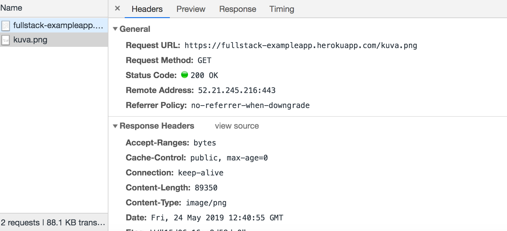
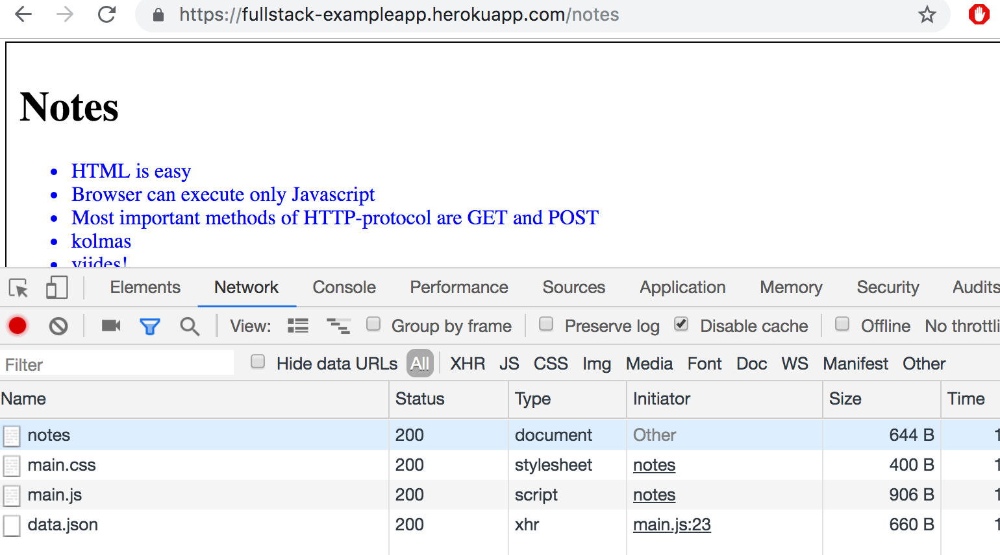
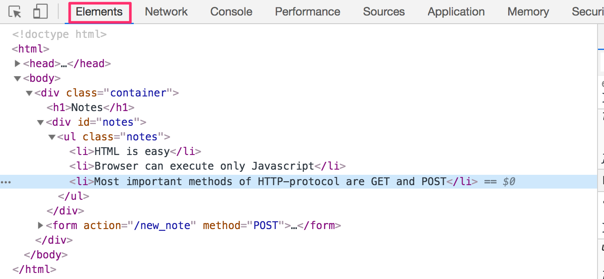
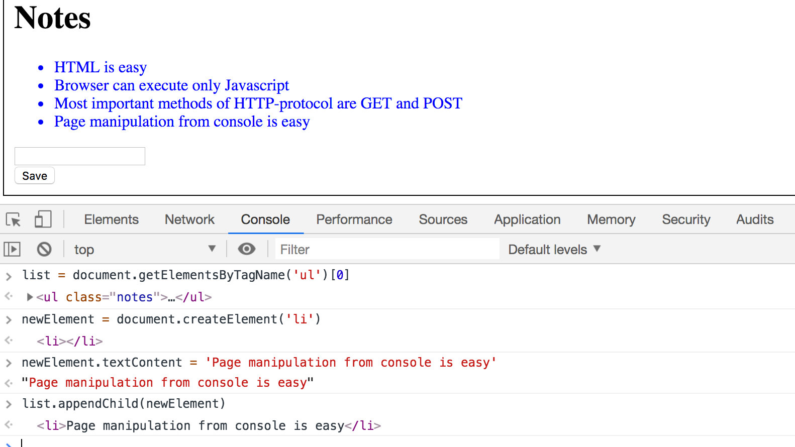
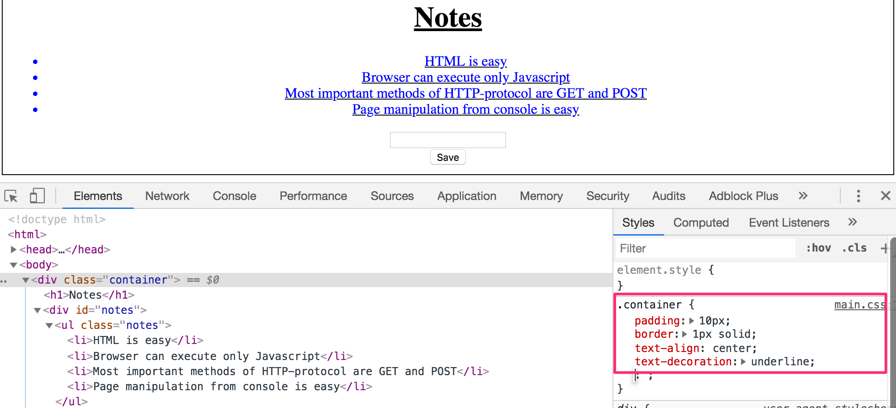
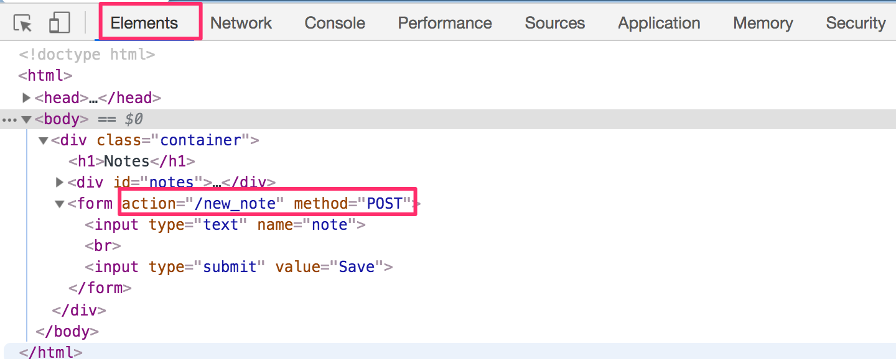
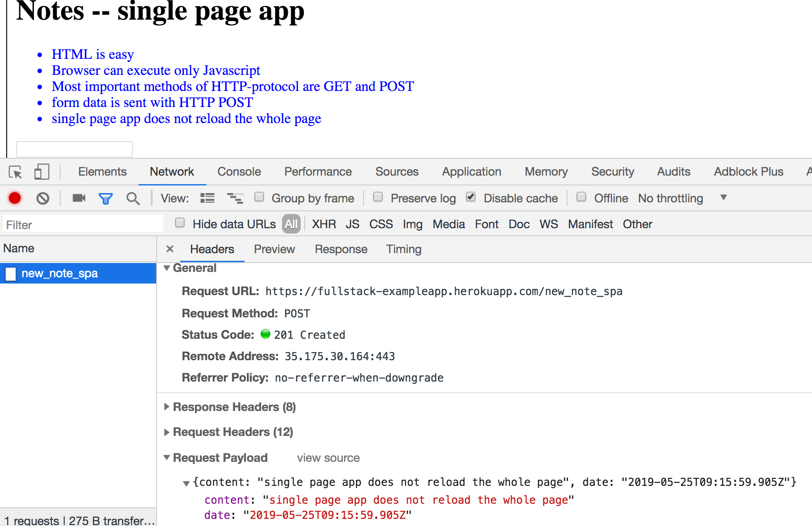
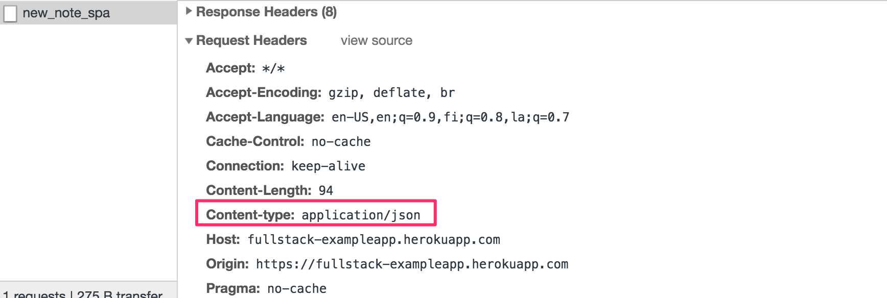

<div class="content">
<!-- Before we start programming, we will go through some principles of web development by examining an example application at <https://studies.cs.helsinki.fi/exampleapp>.-->
 在我们正式开始编程之前，先简单看一个样例应用<https://studies.cs.helsinki.fi/exampleapp>，了解一些 Web 开发的原则。

<!-- The application exists only to demonstrate some basic concepts of the course, and is, by no means, an example of <i>how</i> a modern web application should be made.-->
这个应用只是为了演示课程的一些基本概念，绝不是一个现代 Web 应用应有的样子。
<!-- On the contrary, it demonstrates some old techniques of web development, which could even be considered <i>bad practices</i> nowadays.-->
相反，它展示了一些老旧的网络开发技术，这些技术在今天甚至可以被视作是<i>糟糕的实践</i>。

<!-- Code will conform to contemporary best practices from  [part 1](/en/part1) onwards.-->
 从[第一章节](/en/part1)开始，代码将符合现代开发的最佳实践。

<!-- Open the [example application](https://studies.cs.helsinki.fi/exampleapp) in your browser. Sometimes this takes a while.-->
在浏览器中打开[示例应用](https://studies.cs.helsinki.fi/exampleapp)。有时打开需要等一会儿。

<!-- **The 1st rule of web development**: Always keep the Developer Console open on your web browser. On macOS, open the console by pressing _F12_ or _option-cmd-i_ simultaneously.  On Windows or Linux, open the console by pressing _F12_ or _ctrl-shift-i_ simultaneously. The console can also be opened via the [context menu](https://en.wikipedia.org/wiki/Menu_key).-->
 **Web 开发的第一原则**。始终打开你的网络浏览器上的开发者控制台。在macOS上，通过_F12_或同时按下_option-cmd-i_来打开控制台。  在Windows或Linux上，通过_F12_或同时按_ctrl-shift-i_来打开控制台。控制台也可以通过[上下文菜单](https://en.wikipedia.org/wiki/Menu_key)打开。

<!-- Remember to <i>always</i> keep the Developer Console open when developing web applications.-->
在开发 Web 应用时，请记住<i>始终</i>保持打开开发者控制台。

<!-- The console looks like this:-->
 开发者控制台如下图所示：


<!-- Make sure that the <i>Network</i> tab is open, and check the <i>Disable cache</i> option as shown. <i>Preserve log</i> can also be useful: it saves the logs printed by the application when the page is reloaded.-->
 确保<i>Network（网络）</i>标签打开，并选中<i>Disable cache（禁用缓存）</i>选项，如图。<i>Preserve log（保存日志）</i>也很有用：它可以在重新加载页面时保存应用打印的日志。

<!-- **NB:** The most important tab is the <i>Console</i> tab. However, in this introduction we will be using the <i>Network</i> tab quite a bit.-->
 **NB:**在开发中，最重要的标签是<i>Console（控制台）</i>标签。然而，在这个介绍中，我们将大量使用<i>Network</i>标签。

### HTTP GET

<!-- The server and the web browser communicate with each other using the [HTTP](https://developer.mozilla.org/en-US/docs/Web/HTTP) protocol. The <i>Network</i> tab shows how the browser and the server communicate.-->
 服务器和 Web 浏览器使用[HTTP](https://developer.mozilla.org/en-US/docs/Web/HTTP)协议相互通信。<i>Network（网络）</i>标签显示了浏览器和服务器的通信方式。

<!-- When you reload the page (press the F5 key or the &#8635; symbol on your browser), and the console will show that two events have happened:-->
 当你重新加载页面时（按F5键或浏览器上的&#8635;符号），控制台将显示有两个事件发生：

<!-- - The browser has fetched the contents of the page <i>studies.cs.helsinki.fi/exampleapp</i> from the server-->

 - 浏览器已经从服务器获取了<i>studies.cs.helsinki.fi/exampleapp</i>页面的内容
<!-- - And has downloaded the image <i>kuva.png</i>-->
 - 并已下载了图片<i>kuva.png</i>。


<!-- On a small screen you might have to widen the console window to see these.-->
 在小屏幕上，你可能要放大控制台窗口才能看到这些。

<!-- Clicking the first event reveals more information on what's happening:-->
 点击第一个事件可以看到更多关于本次请求的细节。


<!-- The upper part, <i>General</i>, shows that the browser made a request to the address <i>https://studies.cs.helsinki.fi/exampleapp</i> (though the address has changed slightly since this picture was taken) using the  [GET](https://developer.mozilla.org/en-US/docs/Web/HTTP/Methods/GET) method, and that the request was successful, because the server response had the [Status code](https://en.wikipedia.org/wiki/List_of_HTTP_status_codes) 200.-->
 上半部分，<i>General中的内容</i>，显示浏览器使用[GET](https://developer.mozilla.org/en-US/docs/Web/HTTP/Methods/GET)方法向地址<i>https://studies.cs.helsinki.fi/exampleapp</i>发送了一个请求(地址是截图时的，现在已经略有改变)，并且请求是成功的，因为服务器的响应[状态代码](https://en.wikipedia.org/wiki/List_of_HTTP_status_codes) 为200。

<!-- The request and the server response have several [headers](https://en.wikipedia.org/wiki/List_of_HTTP_header_fields):-->
浏览器的请求（request）和服务器的响应（response）有几个[头信息](https://en.wikipedia.org/wiki/List_of_HTTP_header_fields)。


<!-- The <i>Response headers</i> on top tell us e.g. the size of the response in bytes, and the exact time of the response. An important header [Content-Type](https://developer.mozilla.org/en-US/docs/Web/HTTP/Headers/Content-Type) tells us that the response is a text file in [utf-8](https://en.wikipedia.org/wiki/UTF-8)-format, contents of which have been formatted with HTML. This way the browser knows the response to be a regular [HTML](https://en.wikipedia.org/wiki/HTML)-page, and to render it to the browser 'like a web page'.-->
上面的<i>响应头Response headers</i>告诉我们，例如，响应的字节大小，以及响应的确切时间。一个重要的头信息[Content-Type](https://developer.mozilla.org/en-US/docs/Web/HTTP/Headers/Content-Type)告诉我们，响应是一个[utf-8](https://en.wikipedia.org/wiki/UTF-8)格式的文本文件，其内容已经用HTML格式化。这样，浏览器就知道这个响应是一个普通的[HTML](https://en.wikipedia.org/wiki/HTML)页面，并将其 "像一个网页一样" 渲染到浏览器。

<!-- The <i>Response</i> tab shows the response data, a regular HTML-page. The <i>body</i> section determines the structure of the page rendered to the screen:-->
 <i>Response</i>标签显示了响应数据，是一个普通的HTML页面。<i>body</i>部分决定了渲染到屏幕上的页面的结构。


<!-- The page contains a [div](https://developer.mozilla.org/en-US/docs/Web/HTML/Element/div) element, which in turn contains a heading, a link to the page <i>notes</i>, and an [img](https://developer.mozilla.org/en-US/docs/Web/HTML/Element/img) tag, and displays the number of notes created.-->
 这个页面包含一个[div](https://developer.mozilla.org/en-US/docs/Web/HTML/Element/div)元素，它又包含一个标题，一个指向页面<i>notes</i>的链接，以及一个[img](https://developer.mozilla.org/en-US/docs/Web/HTML/Element/img)标签，并显示创建的笔记数量。

<!-- Because of the img tag, the browser does a second <i>HTTP-request</i> to fetch the image <i>kuva.png</i> from the server. The details of the request are as follows:-->
因为有了img标签，浏览器又做了一次<i>HTTP-request</i>，从服务器上获取图片<i>kuva.png</i>。该请求的细节如下。



<!-- The request was made to the address <https://studies.cs.helsinki.fi/exampleapp/kuva.png> and its type is HTTP GET. The response headers tell us that the response size is 89350 bytes, and its [Content-type](https://developer.mozilla.org/en-US/docs/Web/HTTP/Headers/Content-Type) is <i>image/png</i>, so it is a png image. The browser uses this information to render the image correctly to the screen.-->
 该请求是向地址<https://studies.cs.helsinki.fi/exampleapp/kuva.png>发出的，方法类型是HTTP GET。响应头告诉我们，响应大小为89350字节，其[内容类型](https://developer.mozilla.org/en-US/docs/Web/HTTP/Headers/Content-Type)为<i>image/png</i>，所以它是一个png图像。浏览器利用这些信息将图像正确地渲染在屏幕上。

<!-- The chain of events caused by opening the page https://studies.cs.helsinki.fi/exampleapp on a browser form the following [sequence diagram](https://www.geeksforgeeks.org/unified-modeling-language-uml-sequence-diagrams/):-->
在浏览器上打开网页<https://studies.cs.helsinki.fi/exampleap>，所引起的一系列事件构成了以下[顺序图](https://www.geeksforgeeks.org/unified-modeling-language-uml-sequence-diagrams/)。


<!-- First, the browser sends an HTTP GET request to the server to fetch the HTML code of the page. The <i>img</i> tag in the HTML prompts the browser to fetch the image <i>kuva.png</i>. The browser renders the HTML page and the image to the screen.-->
 首先，浏览器向服务器发送一个HTTP GET请求，以获取该网页的HTML代码。HTML中的<i>img</i>标签提示浏览器获取图片<i>kuva.png</i>。浏览器将HTML页面和图像渲染到屏幕上。

<!-- Even though it is difficult to notice, the HTML page begins to render before the image has been fetched from the server.-->
尽管很难注意到，但在图像从服务器上获取之前，HTML页面就已经开始渲染了。

### Traditional web applications

<!-- The homepage of the example application works like a <i>traditional web application</i>. When entering the page, the browser fetches the HTML document detailing the structure and the textual content of the page from the server.-->
示例应用的主页运行模式类似<i>传统的Web应用</i>。当进入该页面时，浏览器从服务器上获取描述页面结构的HTML文档，以及文本内容。

<!-- The server has formed this document somehow. The document can be a <i>static</i> text file saved into the server's directory. The server can also form the HTML documents <i>dynamically</i>  according to the application code, using, for example, data from a database.-->
服务器以某种方式生成了这个文档。该文档可以是一个保存在服务器目录中的<i>静态</i>文本文件。服务器也可以根据应用代码，例如使用数据库中的数据，动态地形成HTML文档。
<!-- The HTML code of the example application has been formed dynamically, because it contains information on the number of created notes.-->
 示例应用的HTML代码是动态形成的，因为它包含了关于已创建的笔记数量的信息。

<!-- The HTML code of the homepage is as follows:-->
主页的HTML代码如下：

```js
const getFrontPageHtml = (noteCount) => {
  return(`
    <!DOCTYPE html>
    <html>
      <head>
      </head>
      <body>
        <div class='container'>
          <h1>Full stack example app</h1>
          <p>number of notes created ${noteCount}</p>
          <a href='/notes'>notes</a>
          
        </div>
      </body>
    </html>
`)
}

app.get('/', (req, res) => {
  const page = getFrontPageHtml(notes.length)
  res.send(page)
})
```
<!-- You don't have to understand the code just yet.-->
你还不需要理解这些代码。

<!-- The content of the HTML page has been saved as a template string, or a string which allows for evaluating, for example, variables in the midst of it. The dynamically changing part of the homepage, the number of saved notes (in the code <em>noteCount</em>), is replaced by the current number of notes (in the code <em>notes.length</em>) in the template string.-->
HTML页面的内容已被保存为一个模板字符串，或一个能够运行的字符串，例如，在它中间包含变量。主页中动态变化的部分，即保存的笔记数量（即代码中的<em>notesCount</em>），被模板字符串中的当前笔记数量（即代码中的<em>notes.length</em>）所取代。

<!-- Writing HTML in the midst of the code is of course not smart, but for old-school PHP-programmers it was a normal practice.-->
 在代码中间编写 HTML 当然不是明智的做法，但对于老派的 PHP 程序员来说，这是一种常规操作。

<!-- In traditional web applications the browser is "dumb". It only fetches HTML data from the server, and all application logic is on the server. A server can be created using Java Spring (like in the University of Helsinki course [Web-palvelinohjelmointi](https://courses.helsinki.fi/fi/tkt21007/119558639)), Python Flask (like in the course [tietokantasovellus](https://materiaalit.github.io/tsoha-18/)) or with [Ruby on Rails](http://rubyonrails.org/) to name just a few examples.-->
在传统的 web 应用中，浏览器是个“憨憨”。它只从服务器上获取HTML数据，而所有的应用逻辑都在服务器上。服务器可以用Java Spring（如赫尔辛基大学的课程[Web-palvelinohjelmointi](https://courses.helsinki.fi/fi/tkt21007/119558639)）、Python Flask（如课程[tietokantasovellus](https://materiaalit.github.io/tsoha-18/)）或用[Ruby on Rails](http://rubyonrails.org/)来创建，仅举几个例子。

<!-- The example uses [Express](https://expressjs.com/) from Node.js.-->
这个例子使用了Node.js的[Express](https://expressjs.com/)。
<!-- This course will use Node.js and Express to create web servers.-->
本课程将使用Node.js和Express来创建网络服务器。

### Running application logic in the browser

<!-- Keep the Developer Console open. Empty the console by clicking the 🚫 symbol, or by typing clear() in the console.-->
 保持开发者控制台打开。通过点击🚫符号清空控制台，或者在控制台中输入clear()。
<!-- Now when you go to the [notes](https://studies.cs.helsinki.fi/exampleapp/notes) page, the browser does 4 HTTP requests:-->
现在当你进入[notes](https://studies.cs.helsinki.fi/exampleapp/notes)页面时，浏览器会做4个HTTP请求。



<!-- All of the requests have <i>different</i> types. The first request's type is <i>document</i>. It is the HTML code of the page, and it looks as follows:-->
所有的请求都有<i>不同的</i>类型。第一个请求的类型是<i>document</i>。它是页面的HTML代码，看起来如下：


<!-- When we compare the page shown on the browser and the HTML code returned by the server, we notice that the code does not contain the list of notes.-->
当我们比较浏览器上显示的页面和服务器返回的HTML代码时，我们注意到代码中不包含笔记的列表。
<!-- The [head](https://developer.mozilla.org/en-US/docs/Web/HTML/Element/head)-section of the HTML contains a [script](https://developer.mozilla.org/en-US/docs/Web/HTML/Element/script)-tag, which causes the browser to fetch a JavaScript file called <i>main.js</i>.-->
 HTML的[head](https://developer.mozilla.org/en-US/docs/Web/HTML/Element/head)部分包含一个[script](https://developer.mozilla.org/en-US/docs/Web/HTML/Element/script)标签，它使浏览器获取了一个名为<i>main.js</i>的JavaScript文件。

<!-- The JavaScript code looks as follows:-->
 该JavaScript代码看起来如下。

```js
var xhttp = new XMLHttpRequest()

xhttp.onreadystatechange = function() {
  if (this.readyState == 4 && this.status == 200) {
    const data = JSON.parse(this.responseText)
    console.log(data)

    var ul = document.createElement('ul')
    ul.setAttribute('class', 'notes')

    data.forEach(function(note) {
      var li = document.createElement('li')

      ul.appendChild(li)
      li.appendChild(document.createTextNode(note.content))
    })

    document.getElementById('notes').appendChild(ul)
  }
}

xhttp.open('GET', '/data.json', true)
xhttp.send()
```
<!-- The details of the code are not important right now, but some code has been included to spice up the images and the text. We will properly start coding in [part 1](/en/part1). The sample code in this part is actually not relevant at all to the coding techniques of this course.-->
 代码的细节现在并不重要，穿插一些代码，是为了增加图像与文本的趣味性。我们将在[第一章](/en/part1)中正确地开始编码。这一章节的示例代码实际上与本课程的编码技术完全不相关。

<!-- > Some might wonder why xhttp-object is used instead of the modern fetch. This is due to not wanting to go into promises at all yet, and the code having a secondary role in this part. We will return to modern ways to make requests to the server in part 2.-->
 > 有些人可能想问为什么要使用 xhttp 对象而不是使用现代的fetch方法。 这是因为我们不想引入 promise 的概念，而且代码在这一章节只是二等公民。 在第 2 章节中，我们将回过头来用更加现代的方式来向服务器发送请求。

<!-- Immediately after fetching the <i>script</i> tag, the browser begins to execute the code.-->
 在获取了<i>script</i>标签后，浏览器立即开始执行代码。

<!-- The last two lines instruct the browser to do an HTTP GET request to the server's address <i>/data.json</i>:-->
 最后两行指示浏览器对服务器的地址<i>/data.json</i>进行HTTP GET请求。

```js
xhttp.open('GET', '/data.json', true)
xhttp.send()
```
<!-- This is the bottom-most request shown on the Network tab.-->
这是“Network”选项卡上显示的最下面的请求。

<!-- We can try going to the address <https://studies.cs.helsinki.fi/exampleapp/data.json> straight from the browser:-->
 我们可以尝试从浏览器直接访问地址<https://studies.cs.helsinki.fi/exampleapp/data.json>。


<!-- There we find the notes in [JSON](https://en.wikipedia.org/wiki/JSON) "raw data". By default, Chromium-based browsers are not too good at displaying JSON data. Plugins can be used to handle the formatting. Install, for example, [JSONVue](https://chrome.google.com/webstore/detail/jsonview/chklaanhfefbnpoihckbnefhakgolnmc) on Chrome, and reload the page. The data is now nicely formatted:-->
在那里我们找到了[JSON](https://en.wikipedia.org/wiki/JSON) "原始数据 "中的笔记。默认情况下，基于Chromium的浏览器在显示JSON数据方面不是太好。可以使用插件来处理格式化问题。例如，在Chrome上安装[JSONVue](https://chrome.google.com/webstore/detail/jsonview/chklaanhfefbnpoihckbnefhakgolnmc)，然后重新加载页面。现在数据已经被很好地格式化了：


<!-- So, the JavaScript code of the notes page above downloads the JSON-data containing the notes, and forms a bullet-point list from the note contents:-->
 因此，上面的笔记页面的JavaScript代码下载了包含笔记的JSON数据，并从笔记内容中形成了一个符号列表。

<!-- This is done by the following code:-->
 这是由以下代码完成的：

```js
const data = JSON.parse(this.responseText)
console.log(data)

var ul = document.createElement('ul')
ul.setAttribute('class', 'notes')

data.forEach(function(note) {
  var li = document.createElement('li')

  ul.appendChild(li)
  li.appendChild(document.createTextNode(note.content))
})

document.getElementById('notes').appendChild(ul)
```
<!-- The code first creates an unordered list with a [ul](https://developer.mozilla.org/en-US/docs/Web/HTML/Element/ul)-tag...-->
 该代码首先创建了一个带有[ul](https://developer.mozilla.org/en-US/docs/Web/HTML/Element/ul)标签的无序列表...

```js
var ul = document.createElement('ul')
ul.setAttribute('class', 'notes')
```
<!-- ...and then adds one [li](https://developer.mozilla.org/en-US/docs/Web/HTML/Element/li)-tag for each note. Only the <i>content</i> field of each note becomes the contents of the li-tag. The timestamps found in the raw data are not used for anything here.-->
 ...然后再为每个 Note 加上一个 li-标签。仅将每个 Note 的 content 字段变成了 li-标签 的内容，而原始数据的 timestamps 时间戳在这里并没派上用场。

```js
data.forEach(function(note) {
  var li = document.createElement('li')

  ul.appendChild(li)
  li.appendChild(document.createTextNode(note.content))
})
```
<!-- Now open the <i>Console</i>-tab on your Developer Console:-->
 现在在你的开发者控制台打开<i>Console</i>标签。


<!-- By clicking the little triangle at the beginning of the line, you can expand the text on the console.-->
 通过单击行首的小三角形，可以展开控制台上的文本。


<!-- This output on the console is caused by the <em>console.log</em> command in the code:-->
 控制台上的这个输出是由代码中的<em>console.log</em>命令引起的：

```js
const data = JSON.parse(this.responseText)
console.log(data)
```

<!-- So, after receiving data from the server, the code prints it to the console.-->
因此，在从服务器接收到数据之后，代码将其打印到了控制台。

<!-- The <i>Console</i> tab and the <em>console.log</em> command will become very familiar to you during the course.-->
 在整个课程中，你会经常用到  <i>Console</i> 选项卡和 <em>console.log</em> 命令。


### Event handlers and Callback functions

<!-- The structure of this code is a bit odd:-->
这段代码的结构有点奇怪。


```js
var xhttp = new XMLHttpRequest()

xhttp.onreadystatechange = function() {
  // code that takes care of the server response
}

xhttp.open('GET', '/data.json', true)
xhttp.send()
```
<!-- The request to the server is sent on the last line, but the code to handle the response can be found further up. What's going on?-->
发送到服务器的请求放在了最后一行，但是处理响应的代码却在上面定义了。这是怎么回事？

```js
xhttp.onreadystatechange = function () {
```

<!-- On this line, an <i>event handler</i> for event <i>onreadystatechange</i> is defined for the <em>xhttp</em> object doing the request. When the state of the object changes, the browser calls the event handler function. The function code checks that the [readyState](https://developer.mozilla.org/en-US/docs/Web/API/XMLHttpRequest/readyState) equals 4 (which depicts the situation <i>The operation is complete</i>) and that the HTTP status code of the response is 200.-->
 这一行，为进行请求的<em>xhttp</em>对象定义了<i>onreadystatechange</i>事件的<i>event handler</i>。当该对象的状态发生变化时，浏览器会调用事件处理函数。该函数代码检查[readyState](https://developer.mozilla.org/en-US/docs/Web/API/XMLHttpRequest/readyState)是否等于4（描述了<i>操作已经完成</i>的情况），以及响应的HTTP状态代码是否为200。


```js
xhttp.onreadystatechange = function() {
  if (this.readyState == 4 && this.status == 200) {
    // code that takes care of the server response
  }
}
```
<!-- The mechanism of invoking event handlers is very common in JavaScript. Event handler functions are called [callback](https://developer.mozilla.org/en-US/docs/Glossary/Callback_function) functions. The application code does not invoke the functions itself, but the runtime environment - the browser, invokes the function at an appropriate time, when the <i>event</i> has occurred.-->
 调用事件处理程序的机制在JavaScript中非常常见。事件处理函数被称为[回调](https://developer.mozilla.org/en-US/docs/Glossary/Callback_function)函数。应用代码本身并不调用这些函数，但是运行时环境--即浏览器，在适当的时候，即<i>事件</i>发生时，会调用该函数。

### Document Object Model or DOM

<!-- We can think of HTML-pages as implicit tree structures.-->
我们可以将 html 页面看作隐式树结构。

<pre>
html
  head
    link
    script
  body
    div
      h1
      div
        ul
          li
          li
          li
      form
        input
        input
</pre>
<!-- The same treelike structure can be seen on the console tab <i>Elements</i>.-->
同样的树状结构可以在控制台的<i>Elements元素</i>选项卡上看到。



<!-- The functioning of the browser is based on the idea of depicting HTML elements as a tree.-->
 浏览器的工作，就是基于将HTML元素描绘成一棵树。

<!-- Document Object Model, or [DOM](https://en.wikipedia.org/wiki/Document_Object_Model), is an Application Programming Interface (<i>API</i>) which enables programmatic modification of the <i>element trees</i> corresponding to web-pages.-->
文档对象模型Document Object Model，或[DOM](https://en.wikipedia.org/wiki/Document_Object_Model)，是一个应用编程接口(<i>API</i>)，它能够对与网页相对应的<i>元素树</i>进行程序化修改。

<!-- The JavaScript code introduced in the previous chapter used the DOM-API to add a list of notes to the page.-->
 上一章介绍的JavaScript代码就是使用DOM-API在页面中添加了一个笔记列表。

<!-- The following code creates a new node to the variable <em>ul</em>, and adds some child nodes to it:-->
 下面的代码为变量<em>ul</em>创建了一个新节点，并为其添加了一些子节点。

```js
var ul = document.createElement('ul')

data.forEach(function(note) {
  var li = document.createElement('li')

  ul.appendChild(li)
  li.appendChild(document.createTextNode(note.content))
})
```
<!-- Finally, the tree branch of the <em>ul</em> variable is connected to its proper place in the HTML tree of the whole page:-->
 最后，变量<em>ul</em>的树枝被连接到整个页面的HTML树中的适当位置。

```js
document.getElementById('notes').appendChild(ul)
```

### Manipulating the document-object from console

<!-- The topmost node of the DOM tree of an HTML document is called the <em>document</em> object. We can perform various operations on a web-page using the DOM-API. You can access the <em>document</em> object by typing <em>document</em> into the Console-tab:-->
 一个HTML文档的DOM树的最顶端节点被称为<em>document</em>对象。我们可以使用DOM-API在网页上执行各种操作。你可以通过在控制台标签中输入<em>document</em>来访问<em>document</em>对象。


<!-- Let's add a new note to the page from the console.-->
 让我们从控制台向页面添加一个新的笔记。

<!-- First, we'll get the list of notes from the page. The list is in the first ul-element of the page:-->
 首先，我们要从页面上获得笔记的列表。列表在页面的第一个ul-元素中。


```js
list = document.getElementsByTagName('ul')[0]
```

<!-- Then create a new li-element and add some text content to it:-->
 然后创建一个新的li-元素，并在其中添加一些文本内容。

```js
newElement = document.createElement('li')
newElement.textContent = 'Page manipulation from console is easy'
```

<!-- And add the new li-element to the list:-->
 然后将新的li-元素加入到列表中。

```js
list.appendChild(newElement)
```



<!-- Even though the page updates on your browser, the changes are not permanent. If the page is reloaded, the new note will disappear, because the changes were not pushed to the server. The JavaScript code the browser fetches will always create the list of notes based on JSON-data from the address <https://studies.cs.helsinki.fi/exampleapp/data.json>.-->
 虽然页面在你的浏览器上更新，这些变化也不是永久性的。如果页面被重新加载，新的笔记将会消失，因为这些变化没有被推送到服务器上。浏览器获取的JavaScript代码将始终基于来自地址<https://studies.cs.helsinki.fi/exampleapp/data.json>的JSON-数据，来创建笔记列表。

### CSS

<!-- The <i>head</i> element of the HTML code of the Notes page contains a [link](https://developer.mozilla.org/en-US/docs/Web/HTML/Element/link) tag, which determines that the browser must fetch a [CSS](https://developer.mozilla.org/en-US/docs/Web/CSS) style sheet from the address [main.css](https://studies.cs.helsinki.fi/exampleapp/main.css).-->
 笔记页面的HTML代码中的<i>head</i>元素包含一个[link](https://developer.mozilla.org/en-US/docs/Web/HTML/Element/link)标签，它决定了浏览器必须从地址[main.css](https://studies.cs.helsinki.fi/exampleapp/main.css)获取一个[CSS](https://developer.mozilla.org/en-US/docs/Web/CSS)样式表。

<!-- Cascading Style Sheets, or CSS, is a style sheet language used to determine the appearance of web pages.-->
 层叠样式表Cascading Style Sheets，或称CSS，是一种用来决定网页外观的样式表语言。

<!-- The fetched CSS-file looks as follows:-->
获取到的CSS文件看起来如下所示：

```css
.container {
  padding: 10px;
  border: 1px solid;
}

.notes {
  color: blue;
}
```
<!-- The file defines two [class selectors](https://developer.mozilla.org/en-US/docs/Web/CSS/Class_selectors). These are used to select certain parts of the page and to define styling rules to style them.-->
 该文件定义了两个[class selectors类选择器](https://developer.mozilla.org/en-US/docs/Web/CSS/Class_selectors)。这两个选择器用于选择页面的某些部分，并对它们定义样式规则，来装饰它们。

<!-- A class selector definition always starts with a period, and contains the name of the class.-->
 一个类选择器的定义总是以句号开始，并包含类的名称。

<!-- The classes are [attributes](https://developer.mozilla.org/en-US/docs/Web/HTML/Global_attributes/class), which can be added to HTML elements.-->
这些类是[属性](https://developer.mozilla.org/en-US/docs/Web/HTML/Global_attributes/class)，它可以被添加到HTML元素中。

<!-- CSS attributes can be examined on the <i>elements</i> tab of the console:-->
 CSS属性可以在控制台的<i>elements</i>标签中检查。


<!-- The outermost <i>div</i> element has the class <i>container</i>. The <i>ul</i> element containing the list of notes has the class <i>notes</i>.-->
最外层的<i>div</i>元素有<i>container</i>类。包含笔记列表的<i>ul</i>元素有<i>notes</i>类。

<!-- The CSS rule defines that elements with the <i>container</i> class will be outlined with a one pixel wide [border](https://developer.mozilla.org/en-US/docs/Web/CSS/border). It also sets 10 pixel [padding](https://developer.mozilla.org/en-US/docs/Web/CSS/padding) on the element. This adds some empty space between the element's content and the border.-->
 该CSS规则定义了具有<i>container</i>类的元素，将勾勒出一个一像素宽的[边框](https://developer.mozilla.org/en-US/docs/Web/CSS/border)。它还在元素上设置了10像素的[padding](https://developer.mozilla.org/en-US/docs/Web/CSS/padding)。这在元素的内容和边框之间增加了一些空隙。

<!-- The second CSS rule sets the text color of the notes as blue.-->
 第二条CSS规则将笔记的文本颜色设置为蓝色。

<!-- HTML elements can also have other attributes apart from classes. The <i>div</i> element containing the notes has an [id](https://developer.mozilla.org/en-US/docs/Web/HTML/Global_attributes/id) attribute. JavaScript code uses the id to find the element.-->
 除了类之外，HTML元素还可以有其他属性。包含笔记的<i>div</i>元素有一个[id](https://developer.mozilla.org/en-US/docs/Web/HTML/Global_attributes/id)属性。JavaScript代码使用这个id来寻找这个元素。

<!-- The <i>Elements</i> tab of the console can be used to change the styles of the elements.-->
 控制台的<i>Elements</i>标签可以用来改变元素的样式。



<!-- Changes made on the console will not be permanent. If you want to make lasting changes, they must be saved to the CSS style sheet on the server.-->
 在控制台中所作的改变也不会是永久性的。如果你想做永久的改变，必须把它们保存到服务器上的CSS样式表中。

### Loading a page containing JavaScript - review

<!-- Let's review what happens when the page https://studies.cs.helsinki.fi/exampleapp/notes is opened on the browser.-->
 让我们回顾一下在浏览器上打开https://studies.cs.helsinki.fi/exampleapp/notes，会发生什么。


<!-- - The browser fetches the HTML code defining the content and the structure of the page from the server using an HTTP GET request.-->
 - 浏览器使用HTTP GET请求从服务器上获取定义页面内容和结构的HTML代码。
<!-- - Links in the HTML code cause the browser to also fetch the CSS style sheet <i>main.css</i>...-->
 - HTML代码中的链接使浏览器也获取了CSS样式表<i>main.css</i>...
<!-- - ...and a JavaScript code file <i>main.js</i>-->
 - ...和一个JavaScript代码文件<i>main.js</i>。
<!-- - The browser executes the JavaScript code. The code makes an HTTP GET request to the address https://studies.cs.helsinki.fi/exampleapp/data.json, which-->
 - 浏览器执行该JavaScript代码。该代码向地址https://studies.cs.helsinki.fi/exampleapp/data.json 发出HTTP GET请求，该地址
<!--   returns the notes as JSON  data.-->
 以JSON数据形式返回笔记。
<!-- - When the data has been fetched, the browser executes an <i>event handler</i>, which renders the notes to the page using the DOM-API.-->
 - 当数据被获取后，浏览器执行一个<i>事件处理程序</i>，它使用DOM-API将笔记渲染到页面上。

### Forms and HTTP POST

<!-- Next let's examine how adding a new note is done.-->
 接下来让我们来看看如何添加一个新的笔记。

<!-- The Notes page contains a [form-element](https://developer.mozilla.org/en-US/docs/Learn/HTML/Forms/Your_first_HTML_form).-->
 笔记页面包含一个[form表单元素](https://developer.mozilla.org/en-US/docs/Learn/HTML/Forms/Your_first_HTML_form)。


<!-- When the button on the form is clicked, the browser will send the user input to the server. Let's open the <i>Network</i> tab and see what submitting the form looks like:-->
当表单上的按钮被点击时，浏览器将把用户的输入发送到服务器上。让我们打开<i>网络</i>标签，看看提交表单是什么样子。


<!-- Surprisingly, submitting the form causes no less than  <i>five</i> HTTP requests.-->
 很惊奇吧，提交表单会引起至少<i>5</i>个HTTP请求。
<!-- The first one is the form submit event. Let's zoom into it:-->
第一个是表单提交事件。 让我们放大一下:


<!-- It is an [HTTP POST](https://developer.mozilla.org/en-US/docs/Web/HTTP/Methods/POST) request to the server address <i>new\_note</i>. The server responds with HTTP status code 302. This is a [URL redirect](https://en.wikipedia.org/wiki/URL_redirection), with which the server asks the browser to do a new HTTP GET request to the address defined in the header's <i>Location</i> - the address <i>notes</i>.-->
这是一个[HTTP POST](https://developer.mozilla.org/en-US/docs/Web/HTTP/Methods/POST)请求，指向服务器地址<i>new_note</i>。服务器回应的是HTTP状态代码302。这是一个[URL重定向](https://en.wikipedia.org/wiki/URL_redirection)，服务器要求浏览器对头信息<i>Location</i>中定义的地址--即地址<i>notes</i>做一个新的HTTP GET请求。

<!-- So, the browser reloads the Notes page. The reload causes three more HTTP requests: fetching the style sheet (main.css), the JavaScript code (main.js), and the raw data of the notes (data.json).-->
 于是，浏览器重新加载了笔记页面。重载又引起了三个HTTP请求：获取样式表（main.css）、JavaScript代码（main.js）和笔记的原始数据（data.json）。

<!-- The network tab also shows the data submitted with the form:-->
 Network选项卡还显示了随表单提交的数据。


<!-- The Form tag has attributes <i>action</i> and <i>method</i>, which define that submitting the form is done as an HTTP POST request to the address <i>new_note</i>.-->
 表单标签有属性<i>action</i>和<i>method</i>，它们定义了提交表单是以HTTP POST请求的方式完成的，地址为<i>new_note</i>。



<!-- The code on the server responsible for the POST request is quite simple (NB: this code is on the server, and not on the JavaScript code fetched by the browser):-->
服务器上负责POST请求的代码非常简单（注意：这个代码在服务器上，而不是在浏览器获取的JavaScript代码上）。

```js
app.post('/new_note', (req, res) => {
  notes.push({
    content: req.body.note,
    date: new Date(),
  })

  return res.redirect('/notes')
})
```

<!-- Data is sent as the [body](https://developer.mozilla.org/en-US/docs/Web/HTTP/Methods/POST) of the POST-request.-->
 数据被作为POST请求的[body](https://developer.mozilla.org/en-US/docs/Web/HTTP/Methods/POST)发送。


<!-- The server can access the data by accessing the <em>req.body</em> field of the request object <em>req</em>.-->
 服务器可以通过访问请求对象<em>req</em>的<em>req.body</em>字段来访问这些数据。

<!-- The server creates a new note object, and adds it to an array called <em>notes</em>.-->
 服务器创建一个新的Note对象，并将其添加到一个名为<em>notes</em>的数组中。

```js
notes.push({
  content: req.body.note,
  date: new Date(),
})
```

<!-- The Note objects have two fields: <i>content</i> containing the actual content of the note, and <i>date</i> containing the date and time the note was created.-->
 笔记对象有两个字段。<i>content</i>字段包含笔记的实际内容，和<i>date</i>字段包含笔记创建的日期和时间。

<!-- The server does not save new notes to a database, so new notes disappear when the server is restarted.-->
 服务器不会将新的笔记保存到数据库中，所以当服务器重新启动时，新的笔记会消失。

### AJAX

<!-- The Notes page of the application follows an early-nineties style of web development and "uses Ajax". As such, it's on the crest of the wave of early 2000's web technology.-->
 应用的笔记页面遵循九十年代早期的网络开发风格，"使用Ajax"，它处于2000年初网络技术浪潮的顶峰上。

<!-- [AJAX](<https://en.wikipedia.org/wiki/Ajax_(programming)>) (Asynchronous JavaScript and XML) is a term introduced in February 2005 on the back of advancements in browser technology to describe a new revolutionary approach that enabled the fetching of content to web pages using JavaScript included within the HTML, without the need to rerender the page.-->
 [AJAX](<https://en.wikipedia.org/wiki/Ajax_（编程）>)(Asynchronous JavaScript and XML)是2005年2月在浏览器技术进步的背景下引入的一个术语，用来描述一种新的革命性的方法，它能够使用包含在HTML中的JavaScript来获取网页内容，而不需要重新渲染网页。

<!-- Prior to the AJAX era, all web pages worked like the [traditional web application](/en/part0/fundamentals_of_web_apps#traditional-web-applications) we saw earlier in this chapter.-->
 在AJAX时代之前，所有的网页都像我们在本章前面看到的[传统网络应用](/en/part0/fundamentals_of_web_apps#traditional-web-applications)那样工作。
<!-- All of the data shown on the page was fetched with the HTML-code generated by the server.-->
页面上显示的所有数据都是通过服务器生成的HTML代码获取的。

<!-- The Notes page uses AJAX to fetch the notes data. Submitting the form still uses the traditional mechanism of submitting web-forms.-->
 笔记页面使用AJAX来获取笔记数据。提交表单仍然使用传统的提交网络表单的机制。

<!-- The application URLs reflect the old, carefree times. JSON data is fetched from the url <https://studies.cs.helsinki.fi/exampleapp/data.json> and new notes are sent to the URL <https://studies.cs.helsinki.fi/exampleapp/new_note>.-->
 应用的URL反映了古老的、无忧无虑的时代。JSON数据从URL <https://studies.cs.helsinki.fi/exampleapp/data.json>中获取，新的笔记被发送到URL <https://studies.cs.helsinki.fi/exampleapp/new_note>中。
<!-- Nowadays URLs like these would not be considered acceptable, as they don't follow the generally acknowledged conventions of [RESTful](https://en.wikipedia.org/wiki/Representational_state_transfer#Applied_to_Web_services) APIs, which we'll look into more in [part 3](/en/part3)-->
 现在像这样的URL是不会被接受的，因为它们不遵循公认的[RESTful](https://en.wikipedia.org/wiki/Representational_state_transfer#Applied_to_Web_services)API的惯例，我们将在[第三章](/en/part3)中进一步研究。

<!-- The thing termed AJAX is now so commonplace that it's taken for granted. The term has faded into oblivion, and the new generation has not even heard of it.-->
 称为AJAX的东西现在已经非常普遍，以至于被认为是理所当然的。这个词已经被遗忘了，新生代甚至没有听说过它。

### Single page app

<!-- In our example app, the home page works like a traditional web-page: All of the logic is on the server, and the browser only renders the HTML as instructed.-->
 在我们的示例应用中，主页的工作方式与传统的网页一样。所有的逻辑都在服务器上，而浏览器只按照指示渲染HTML。

<!-- The Notes page gives some of the responsibility, generating the HTML code for existing notes, to the browser. The browser tackles this task by executing the JavaScript code it fetched from the server. The code fetches the notes from the server as JSON-data and adds HTML elements for displaying the notes to the page using the [DOM-API](/en/part0/fundamentals_of_web_apps#document-object-model-or-dom).-->
 笔记页面把生成现有笔记的HTML代码的部分责任交给了浏览器。浏览器通过执行从服务器上获取的JavaScript代码来完成这项任务。这些代码从服务器上获取JSON数据，并使用[DOM-API](/en/part0/fundamentals_of_web_apps#document-object-model-or-dom)在页面上添加显示笔记的HTML元素。

<!-- In recent years, the [Single-page application](https://en.wikipedia.org/wiki/Single-page_application) (SPA) style of creating web-applications has emerged. SPA-style websites don't fetch all of their pages separately from the server like our sample application does, but instead comprise only one HTML page fetched from the server, the contents of which are manipulated with JavaScript that executes in the browser.-->
近年来，出现了创建网络应用的[单页应用](https://en.wikipedia.org/wiki/Single-page_application) (SPA)风格。SPA风格的网站并不像我们的样例应用那样从服务器上单独获取所有的页面，而是只由一个从服务器上获取的HTML页面组成，其内容由在浏览器中执行的JavaScript来操作。

<!-- The Notes page of our application bears some resemblance to SPA-style apps, but it's not quite there yet. Even though the logic for rendering the notes is run on the browser, the page still uses the traditional way of adding new notes. The data is sent to the server with form submit, and the server instructs the browser to reload the Notes page with a <i>redirect</i>.-->
 我们应用的笔记页面与SPA风格的应用有一些相似之处，但还没有完全达到目的。尽管渲染笔记的逻辑是在浏览器上运行的，但该页面仍然使用传统的方式来添加新的笔记。数据通过表单提交被发送到服务器，服务器通过<i>redirect</i>指示浏览器重新加载笔记页面。

<!-- A single page app version of our example application can be found at <https://studies.cs.helsinki.fi/exampleapp/spa>.-->
 我们的例子应用的单页应用版本可以在<https://studies.cs.helsinki.fi/exampleapp/spa>找到。
<!-- At first glance, the application looks exactly the same as the previous one.-->
 乍看之下，这个应用与之前的应用完全一样。
<!-- The HTML code is almost identical, but the JavaScript file is different (<i>spa.js</i>) and there is a small change in how the form-tag is defined:-->
HTML代码几乎相同，但JavaScript文件不同（<i>spa.js</i>），而且在定义form-tag的方式上有一点变化。


<!-- The form has no <i>action</i> or <i>method</i> attributes to define how and where to send the input data.-->
 这个表单没有<i>action</i>或<i>method</i>属性来定义如何和往哪里发送输入数据。

<!-- Open the <i>Network</i>-tab and empty it. When you now create a new note, you'll notice that the browser sends only one request to the server.-->
 打开<i>网络</i>-标签并清空它。当你现在创建一个新的笔记时，你会发现浏览器只向服务器发送了一个请求。



<!-- The POST request to the address <i>new\_note\_spa</i> contains the new note as JSON-data containing both the content of the note (<i>content</i>) and the timestamp (<i>date</i>):-->
 发送到地址<i>new_note/spa</i>的POST请求包含了新笔记的JSON数据，包含了笔记的内容（<i>content</i>）和时间戳（<i>date</i>）。

```js
{
  content: "single page app does not reload the whole page",
  date: "2019-05-25T15:15:59.905Z"
}
```

<!-- The <i>Content-Type</i> header of the request tells the server that the included data is represented in the JSON format.-->
 请求的<i>Content-Type</i>头告诉服务器，包含的数据是以JSON格式表示的。



<!-- Without this header, the server would not know how to correctly parse the data.-->
 如果没有这个头，服务器将不知道如何正确解析数据。

<!-- The server responds with status code [201 created](https://httpstatuses.com/201). This time the server does not ask for a redirect, the browser stays on the same page, and it sends no further HTTP requests.-->
 服务器以状态代码[201创建](https://httpstatuses.com/201)进行响应。这一次服务器没有要求重定向，浏览器停留在同一个页面上，并且没有再发送HTTP请求。

<!-- The SPA version of the app does not send the form data in the traditional way, but instead uses the JavaScript code it fetched from the server.-->
 应用的SPA版本没有以传统方式发送表单数据，而是使用了它从服务器上获取的JavaScript代码。
<!-- We'll look into this code a bit, even though understanding all the details of it is not important just yet.-->
 我们将研究一下这段代码，尽管还不重要理解它的所有细节。

```js
var form = document.getElementById('notes_form')
form.onsubmit = function(e) {
  e.preventDefault()

  var note = {
    content: e.target.elements[0].value,
    date: new Date(),
  }

  notes.push(note)
  e.target.elements[0].value = ''
  redrawNotes()
  sendToServer(note)
}
```

<!-- The command <em>document.getElementById('notes\_form')</em> instructs the code to fetch the form-element from the page, and to register an <i>event handler</i> to handle the form submit event. The event handler immediately calls the method <em>e.preventDefault()</em> to prevent the default handling of form submit. The default method would send the data to the server and cause a new GET request, which we don't want to happen.-->
 命令<em>document.getElementById('notes\_form')</em>指示代码从页面上获取表单元素，并注册一个<i>事件处理程序</i>来处理表单提交事件。该事件处理程序立即调用方法<em>e.preventDefault()</em>来阻止表单提交的默认处理。默认方法会将数据发送到服务器并导致一个新的GET请求，这是我们不希望发生的。

<!-- Then the event handler creates a new note, adds it to the notes list with the command <em>notes.push(note)</em>, rerenders the note list on the page and sends the new note to the server.-->
 然后事件处理函数创建了一个新的笔记，用<em>notes.push(note)</em>命令将其添加到笔记列表中，重新渲染页面上的笔记列表，并将新笔记发送到服务器。

<!-- The code for sending the note to the server is as follows:-->
 发送笔记到服务器的代码如下。

```js
var sendToServer = function(note) {
  var xhttpForPost = new XMLHttpRequest()
  // ...

  xhttpForPost.open('POST', '/new_note_spa', true)
  xhttpForPost.setRequestHeader(
    'Content-type', 'application/json'
  )
  xhttpForPost.send(JSON.stringify(note))
}
```

<!-- The code determines that the data is to be sent with an HTTP POST request and the data type is to be JSON. The data type is determined with a <i>Content-type</i> header. Then the data is sent as JSON-string.-->
 该代码确定数据将以HTTP POST请求发送，数据类型为JSON。数据类型由<i>Content-type</i>头决定。然后，数据被作为JSON-字符串发送。

<!-- The application code is available at <https://github.com/mluukkai/example_app>.-->
 应用代码可在<https://github.com/mluukkai/example_app>中找到。
<!-- It's worth remembering that the application is only meant to demonstrate the concepts of the course. The code follows a poor style of development in some measure, and should not be used as an example when creating your own applications. The same is true for the URLs used. The URL <i>new\_note\_spa</i>, which new notes are sent to, does not adhere to current best practices.-->
 值得记住的是，这个应用只是为了演示课程的概念。代码在某种程度上遵循了不良的开发风格，在创建你自己的应用时，不应作为一个例子来使用。所用的URL也是如此。发送新笔记的URL <i>new_note\_spa</i>并不符合当前的最佳实践。

### JavaScript-libraries

<!-- The sample app is done with so called [vanilla JavaScript](https://www.freecodecamp.org/news/is-vanilla-javascript-worth-learning-absolutely-c2c67140ac34/), using only the DOM-API and JavaScript to manipulate the structure of the pages.-->
 这个样本应用是用所谓的[vanilla JavaScript](https://www.freecodecamp.org/news/is-vanilla-javascript-worth-learning-absolutely-c2c67140ac34/)完成的，只使用DOM-API和JavaScript来操作页面的结构。

<!-- Instead of using JavaScript and the DOM-API only, different libraries containing tools that are easier to work with compared to the DOM-API are often used to manipulate pages. One of these libraries is the ever-so-popular [jQuery](https://jquery.com/).-->
 与其只使用JavaScript和DOM-API，不如使用包含更简易工具的库，与DOM-API相比更容易操作，通常用于操作页面。这些库中一个一直很流行的是[jQuery](https://jquery.com/)。

<!-- jQuery was developed back when web applications mainly followed the traditional style of the server generating HTML pages, the functionality of which was enhanced on the browser side using JavaScript written with jQuery. One of the reasons for the success of jQuery was its so-called cross-browser compatibility. The library worked regardless of the browser or the company that made it, so there was no need for browser-specific solutions. Nowadays using jQuery is not as justified given the advancement of JavaScript, and the most popular browsers generally support basic functionalities well.-->
 jQuery是早在网络应用主要遵循服务器生成HTML页面的传统风格时开发的，这种风格的功能通过在浏览器端使用 JavaScript 搭配使用 jQuery 来增强。。jQuery成功的原因之一是其所谓的跨浏览器兼容性。这个库无论在哪种浏览器或制造它的公司都能工作，所以不需要针对浏览器的解决方案。如今，考虑到JavaScript的发展，使用jQuery就不那么合理了，最流行的浏览器一般都能很好地支持基本功能。

<!-- The rise of the single page app brought several more "modern" ways of web development than jQuery. The favorite of the first wave of developers was [BackboneJS](http://backbonejs.org/). After its [launch](https://github.com/angular/angular.js/blob/master/CHANGELOG.md#100-temporal-domination-2012-06-13) in 2012, Google's [AngularJS](https://angularjs.org/) quickly became almost the de facto standard of modern web development.-->
 单页应用的兴起带来了几种比jQuery更 "现代 "的网页开发方式。第一波开发者的最爱是[BackboneJS](http://backbonejs.org/)。在2012年[推出](https://github.com/angular/angular.js/blob/master/CHANGELOG.md#100-temporal-domination-2012-06-13)之后，谷歌的[AngularJS](https://angularjs.org/)迅速成为现代网页开发的事实标准。

<!-- However, the popularity of Angular plummeted in October 2014 after the [Angular team announced that support for version 1 will end](https://jaxenter.com/angular-2-0-announcement-backfires-112127.html), and Angular 2 will not be backwards compatible with the first version. Angular 2 and the newer versions have not gotten too warm of a welcome.-->
然而，2014年10月，在[Angular团队宣布对第一版的支持将结束](https://jaxenter.com/angular-2-0-announcement-backfires-112127.html)，Angular 2不会向后兼容第一版后，Angular的人气骤降。Angular 2和较新的版本并没有得到太热烈的欢迎。

<!-- Currently the most popular tool for implementing the browser-side logic of web-applications is Facebook's [React](https://reactjs.org/) library.-->
目前最流行的实现网络应用逻辑的浏览器端的工具是Facebook's [React](https://reactjs.org/)库。
<!-- During this course, we will get familiar with React and the [Redux](https://github.com/reactjs/redux) library, which are frequently used together.-->
在本课程中，我们将熟悉React和[Redux](https://github.com/reactjs/redux)库，它们经常被一起使用。

<!-- The status of React seems strong, but the world of JavaScript is ever changing. For example, recently a newcomer - [VueJS](https://vuejs.org/) - has been capturing some interest.-->
 React的地位似乎很强大，但JavaScript的世界是不断变化的。例如，最近一个新来者--[VueJS](https://vuejs.org/)--已经吸引了一些人的兴趣。

### Full stack web development

<!-- What does the name of the course, <i>Full stack web development</i>, mean? Full stack is a buzzword that everyone talks about, while no one really knows what it means. Or at least, there is no agreed-upon definition for the term.-->
课程名称，<i>全栈网络开发</i>，是什么意思？全栈是一个人人都在谈论的流行语，而没有人真正知道它的含义。或者说，至少对这个词没有一个公认的定义。

<!-- Practically all web applications have (at least) two "layers": the browser, being closer to the end-user, is the top layer, and the server the bottom one. There is often also a database layer below the server. We can therefore think of the <i>architecture</i> of a web application as a kind of <i>stack</i> of layers.-->
 实际上，所有的网络应用都有（至少）两个 "层"：浏览器更接近最终用户，是最上面的一层，而服务器是下面的一层。在服务器下面通常还有一个数据库层。因此，我们可以把网络应用的<i>架构</i>看作是一种<i>堆栈</i>。

<!-- Often, we also talk about the [frontend and the backend](https://en.wikipedia.org/wiki/Front_and_back_ends). The browser is the frontend, and JavaScript that runs on the browser is frontend code. The server on the other hand is the backend.-->
 通常，我们还谈论[前端和后端](https://en.wikipedia.org/wiki/Front_and_back_ends)。浏览器是前端，在浏览器上运行的JavaScript是前端代码。另一边，服务器则是后端。

<!-- In the context of this course, full stack web development means that we focus on all parts of the application: the frontend, the backend, and the database. Sometimes the software on the server and its operating system are seen as parts of the stack, but we won't go into those.-->
在本课程中，全栈式网络开发意味着我们关注应用的所有部分：前端、后端和数据库。有时，服务器上的软件和它的操作系统也被看作是堆栈的一部分，但我们不会去研究这些。

<!-- We will code the backend with JavaScript, using the [Node.js](https://nodejs.org/en/) runtime environment. Using the same programming language on multiple layers of the stack gives full stack web development a whole new dimension. However, it's not a requirement of full stack web development to use the same programming language (JavaScript) for all layers of the stack.-->
 我们将使用[Node.js](https://nodejs.org/en/)运行环境，用JavaScript对后端进行编码。在堆栈的多个层次上使用相同的编程语言给全栈网络开发带来了一个全新的层面。然而，全栈网络开发并不要求所有的栈都使用相同的编程语言（JavaScript）。

<!-- It used to be more common for developers to specialize in one layer of the stack, for example the backend. Technologies on the backend and the frontend were quite different. With the Full stack trend, it has become common for developers to be proficient on all layers of the application and the database. Oftentimes, full stack developers must also have enough configuration and administration skills to operate their application, for example, in the cloud.-->
 过去，开发人员专门从事堆栈的某一层，例如后端，是比较常见的。后端和前端的技术是完全不同的。随着全栈趋势的发展，开发人员熟练掌握应用和数据库的所有层已经成为普遍现象。通常情况下，全栈开发人员还必须有足够的配置和管理技能来操作他们的应用，例如，上云。

### JavaScript fatigue

<!-- Full stack web development is challenging in many ways. Things are happening in many places at once, and debugging is quite a bit harder than with regular desktop applications. JavaScript does not always work as you'd expect it to (compared to many other languages), and the asynchronous way its runtime environments work causes all sorts of challenges. Communicating on the web requires knowledge of the HTTP protocol. One must also handle databases and server administration and configuration. It would also be good to know enough CSS to make applications at least somewhat presentable.-->
全栈 web 开发在许多方面都具有挑战性。 在许多地方会有突发情况，并且调试起来比普通桌面应用要困难得多。 JavaScript (与许多其他语言相比) 并不总是像你期望的那样工作 ，其运行时环境的异步工作方式带来了各种各样的挑战。 网络中的通信需要对 http 协议的知识储备。 还必须处理数据库、服务器管理和配置。 了解足够的 CSS 至少在一定程度上能够使应用显得好看。

<!-- The world of JavaScript develops fast, which brings its own set of challenges. Tools, libraries and the language itself are under constant development. Some are starting to get tired of the constant change, and have coined a term for it: <em>JavaScript fatigue</em>. See [How to Manage JavaScript Fatigue on auth0](https://auth0.com/blog/how-to-manage-javascript-fatigue/) or [JavaScript fatigue on Medium](https://medium.com/@ericclemmons/javascript-fatigue-48d4011b6fc4).-->
 JavaScript的世界发展迅速，这带来了它自己的一系列挑战。工具、库和语言本身都在不断发展。有些人开始对这种不断的变化感到厌倦，并为此创造了一个术语。<em>JavaScript 疲劳</em>。可以阅读[auth0上的如何管理JavaScript疲劳](https://auth0.com/blog/how-to-manage-javascript-fatigue/) 或[Medium上的JavaScript疲劳](https://medium.com/@ericclemmons/javascript-fatigue-48d4011b6fc4)。

<!-- You will suffer from JavaScript fatigue yourself during this course. Fortunately for us, there are a few ways to smooth the learning curve, and we can start with coding instead of configuration. We can't avoid configuration completely, but we can merrily push ahead in the next few weeks while avoiding the worst of configuration hells.-->
在这个课程中，你自己也会遭受到JavaScript的疲劳。幸运的是，有一些方法可以使学习曲线变得平滑，我们可以从编码而不是配置开始。我们不能完全避免配置，但我们可以在接下来的几周里愉快地推进，同时避开最糟糕的配置地狱。

</div>

<div class="tasks">
<!--   <h3>Exercises 0.1.-0.6.</h3>-->
 <h3>练习0.1.-0.6.</h3> </h3>

<!-- The exercises are submitted via GitHub, and by marking the exercises as done in the [submission system](https://studies.cs.helsinki.fi/stats/courses/fullstackopen).-->
 练习通过GitHub提交，并在[提交系统](https://studies.cs.helsinki.fi/stats/courses/fullstackopen)中标记练习完成。

<!-- You can submit all of the exercises into the same repository, or use multiple different repositories. If you submit exercises from different parts into the same repository, name your directories well. If you use a private repository to submit the exercises, add _mluukkai_ as a collaborator to it.-->
你可以将所有的练习提交到同一个仓库，或者使用多个不同的仓库。如果你将不同部分的练习提交到同一个仓库中，请将你的目录命名好。如果你使用一个私人仓库来提交练习，把_mluukkai_作为合作者加入其中。

<!-- One good way to name the directories in your submission repository is as follows:-->
在你的提交仓库中命名目录的一个好方法如下：

```
part0
part1
  courseinfo
  unicafe
  anecdotes
part2
  courseinfo
  phonebook
  countries
```

<!-- So, each part has its own directory, which contains a directory for each exercise set (like the unicafe exercises in part 1).-->
 也就是，每个章节都有自己的目录，其中包含每个练习集的目录（如第一章节的unicafe练习）。

<!-- The exercises are submitted **one part at a time**. When you have submitted the exercises for a part, you can no longer submit any missed exercises for that part.-->
 练习是**一次提交一个章节的**。当你提交了一个章节的练习，你就不能再提交该章节任何遗漏的练习。

<!--   <h4>0.1: HTML</h4>-->
<h4>0.1: HTML</h4>

<!-- Review the basics of HTML by reading this tutorial from Mozilla: [HTML tutorial](https://developer.mozilla.org/en-US/docs/Learn/Getting_started_with_the_web/HTML_basics).-->
通过阅读Mozilla的这个教程来复习HTML的基础知识：[HTML教程](https://developer.mozilla.org/en-US/docs/Learn/Getting_started_with_the_web/HTML_basics)。

<i>This exercise is not submitted to GitHub, it's enough to just read the tutorial</i>

这个练习不用提交GitHub，仅仅阅读教程即可。

<!--   <h4>0.2: CSS</h4>-->
 <h4>0.2: CSS</h4> 

<!-- Review the basics of CSS by reading this tutorial from Mozilla: [CSS tutorial](https://developer.mozilla.org/en-US/docs/Learn/Getting_started_with_the_web/CSS_basics).-->
 通过阅读Mozilla的这个教程来复习CSS的基础知识：[CSS教程](https://developer.mozilla.org/en-US/docs/Learn/Getting_started_with_the_web/CSS_basics)。

<i>This exercise is not submitted to GitHub, it's enough to just read the tutorial</i>

这个练习不用提交GitHub，仅仅阅读教程即可。

<!--   <h4>0.3: HTML forms</h4>-->

 <h4>0.3: HTML表单</h4> 

<!-- Learn about the basics of HTML forms by reading Mozilla's tutorial [Your first form](https://developer.mozilla.org/en-US/docs/Learn/HTML/Forms/Your_first_HTML_form).-->
 通过阅读Mozilla的教程[你的第一个表单](https://developer.mozilla.org/en-US/docs/Learn/HTML/Forms/Your_first_HTML_form)来了解HTML表单的基础知识。

<i>This exercise is not submitted to GitHub, it's enough to just read the tutorial</i>

这个练习不用提交GitHub，仅仅阅读教程即可。


<!--   <h4>0.4: New note</h4>-->

<h4>0.4: 新的笔记</h4>

<!-- In chapter [Loading a page containing JavaScript - review](/en/part0/fundamentals_of_web_apps#loading-a-page-containing-java-script-review) the chain of events caused by opening the page <https://studies.cs.helsinki.fi/exampleapp/notes> is depicted as a [sequence diagram](https://www.geeksforgeeks.org/unified-modeling-language-uml-sequence-diagrams/)-->
 在[加载含有JavaScript的页面-回顾](/en/part0/fundamentals_of_web_apps#loading-a-page-containing-java-script-review)一章中，打开页面<https://studies.cs.helsinki.fi/exampleapp/notes>所引起的事件链被描绘成一个[序列图](https://www.geeksforgeeks.org/unified-modeling-language-uml-sequence-diagrams/)

<!-- The diagram was made using [websequencediagrams](https://www.websequencediagrams.com) service as follows:-->
 该图是使用[websequencediagrams](https://www.websequencediagrams.com)服务制作的，如下。

```
browser->server: HTTP GET https://studies.cs.helsinki.fi/exampleapp/notes
server-->browser: HTML-code
browser->server: HTTP GET https://studies.cs.helsinki.fi/exampleapp/main.css
server-->browser: main.css
browser->server: HTTP GET https://studies.cs.helsinki.fi/exampleapp/main.js
server-->browser: main.js

note over browser:
browser starts executing js-code
that requests JSON data from server
end note

browser->server: HTTP GET https://studies.cs.helsinki.fi/exampleapp/data.json
server-->browser: [{ content: "HTML is easy", date: "2019-05-23" }, ...]

note over browser:
browser executes the event handler
that renders notes to display
end note
```

<!-- **Create a similar diagram** depicting the situation where the user creates a new note on page <https://studies.cs.helsinki.fi/exampleapp/notes> when writing something into the text field and clicking the <i>submit</i> button.-->
 **创建一个类似的图**，描述当用户把东西写进文本字段并点击<i>submit</i>按钮，在<https://studies.cs.helsinki.fi/exampleapp/notes>页上创建一个新笔记的情况。

<!-- If necessary, show operations on the browser or on the server as comments on the diagram.-->
 如果有必要，将浏览器或服务器上的操作显示为图中的注释。

<!-- The diagram does not have to be a sequence diagram. Any sensible way of presenting the events is fine.-->
 该图不一定是一个序列图。任何合理的渲染事件方式都是可以的。

<!-- All necessary information for doing this, and the next two exercises, can be found from the text of [this part](/en/part0/fundamentals_of_web_apps#forms-and-http-post).-->
所有做这个的必要信息，以及接下来的两个练习，都可以从[本章](/en/part0/fundamentals_of_web_apps#forms-and-http-post)的正文中找到。
<!-- The idea of these exercises is to read the text through once more, and to think through what is going on there. Reading the application [code](https://github.com/mluukkai/example_app) is not necessary, but it is of course possible.-->
 这些练习的目的是再一次通读文本，并思考其中的内容。阅读应用的[代码](https://github.com/mluukkai/example_app)不是必须的，但当然也可以。

<!--   <h4>0.5: Single page app</h4>-->
 <h4>0.5: 单页应用</h4

<!-- Create a diagram depicting the situation where the user goes to the [single page app](/en/part0/fundamentals_of_web_apps#single-page-app) version of the notes app at <https://studies.cs.helsinki.fi/exampleapp/spa>.-->
 创建一个图表，描述用户进入[单页应用](/en/part0/fundamentals_of_web_apps#single-page-app)版本的笔记应用的情况，网址为<https://studies.cs.helsinki.fi/exampleapp/spa>。

<!--   <h4>0.6: New note</h4>-->
<h4>0.6: 新的笔记</h4>

<!-- Create a diagram depicting the situation where the user creates a new note using the single page version of the app.-->
 创建一个图表，描述用户使用单页版应用创建新笔记的情况。

<!-- This was the last exercise, and it's time to push your answers to GitHub and mark the exercises as done in the [submission system](https://studies.cs.helsinki.fi/stats/courses/fullstackopen).-->
这是最后一个练习，是时候把你的答案推送到GitHub，并在[提交系统](https://studies.cs.helsinki.fi/stats/courses/fullstackopen)中标记练习完成。

</div>
