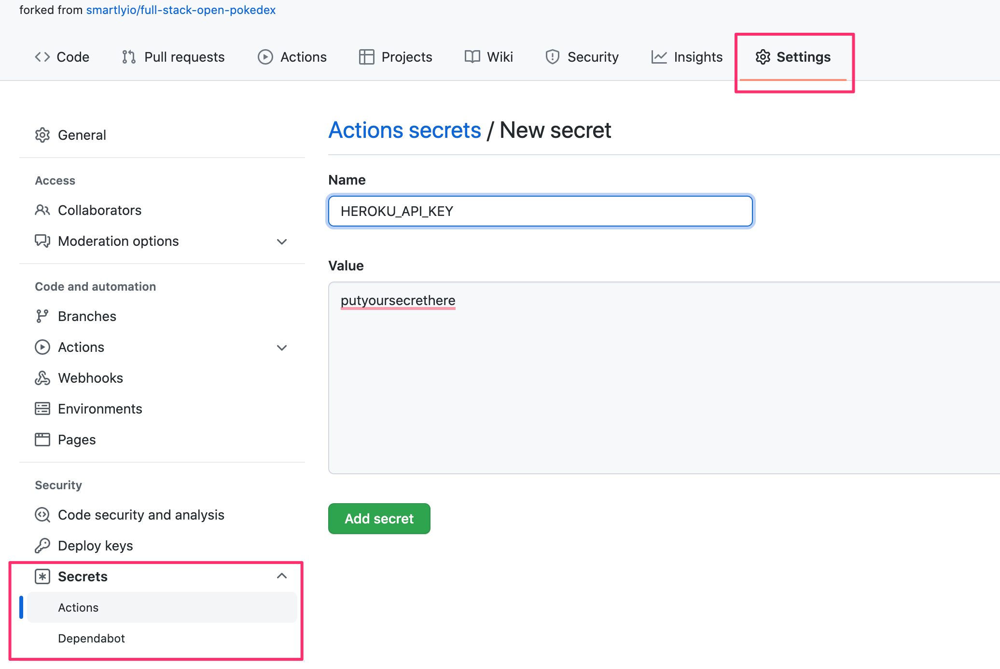
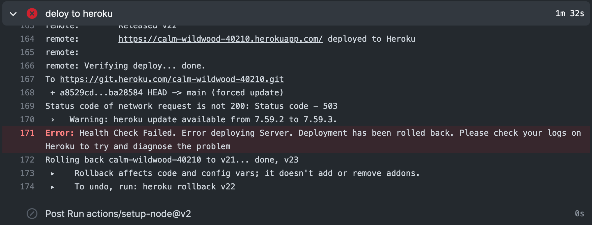

<div class="content">

<!-- Having written a nice application it's time to think about how we're going to deploy it to the use of real users.-->
 在写好了一个漂亮的应用之后，是时候考虑我们如何将其部署到真正的用户中去了。

<!-- In [part 3](/en/part3/deploying_app_to_internet) of this course, we did this by simply <i>pushing the git repository</i> to the servers of the cloud provider [Heroku](https://www.heroku.com/home). It is pretty simple to release software in Heroku at least compared to many other types of hosting setups but it still contains risks: nothing prevents us from accidentally pushing broken code to production.-->
 在本课程的[第三章节](/en/part3/deploying_app_to_internet)中，我们通过简单的<i>推送git仓库</i>到云提供商[Heroku](https://www.heroku.com/home)的服务器来实现。至少与许多其他类型的托管设置相比，在Heroku中发布软件是相当简单的，但它仍然包含风险：没有什么能阻止我们意外地将破损的代码推到生产中。

<!-- Next, we're going to look at the principles of making a deployment safely and some of the principles of deploying software on both a small and large scale.-->
 接下来，我们要看一下安全部署的原则，以及在小规模和大规模部署软件的一些原则。

### Anything that can go wrong...

<!-- We'd like to define some rules about how our deployment process should work but before that, we have to look at some constraints of reality.-->
 我们想定义一些关于我们的部署过程应该如何工作的规则，但在这之前，我们必须看看现实的一些限制。

<!-- One on the phrasing of Murphy's Law holds that:-->
"墨菲定律 "的一个措辞认为。
<!--   "Anything that can go wrong will go wrong."-->
 "任何可能出错的事情都会出错。"

<!-- It's important to remember this when we plan out our deployment system. Some of the things we'll need to consider could include:-->
 当我们计划我们的部署系统时，记住这一点很重要。我们需要考虑的一些事情可能包括。
<!--  - What if my PC crashes or hangs during deployment?-->
 -如果我的电脑在部署过程中崩溃或挂起怎么办？
<!--  - I'm connected to the server and deploying over the internet, what happens if my internet connection dies?-->
 - 我连接到服务器并通过互联网进行部署，如果我的互联网连接中断了会怎样？
<!--  - What happens if any specific instruction in my deployment script/system fails?-->
 - 如果我的部署脚本/系统中的任何特定指令失败会怎样？
<!--  - What happens if, for whatever reason, my software doesn't work as expected on the server I'm deploying to? Can I roll back to a previous version?-->
 - 如果由于某种原因，我的软件在我部署的服务器上不能按预期工作，会发生什么？我可以回滚到以前的版本吗？
<!--  - What happens if a user does an HTTP request to our software just before we do deployment (we didn't have time to send a response to the user)?-->
 - 如果一个用户在我们进行部署之前对我们的软件做了一个HTTP请求（我们没有时间向用户发送响应）会发生什么？

<!-- These are just a small selection of what can go wrong during a deployment, or rather, things that we should plan for. Regardless of what happens, our deployment system should **never** leave our software in a broken state. We should also always know (or be easily able to find out) what state a deployment is in.-->
 这些只是部署过程中可能出错的一小部分，或者说，我们应该计划的事情。无论发生什么，我们的部署系统都不应该***让我们的软件处于破碎状态。我们也应该总是知道（或者很容易找到）一个部署处于什么状态。

<!-- Another important rule to remember when it comes to deployments (and CI in general) is:-->
 当涉及到部署（和一般的CI）时，要记住的另一个重要规则是。
<!--   "Silent failures are **very** bad!"-->
 "无声的失败是***糟糕的！"

<!-- This doesn't mean that failures need to be shown to the users of the software, it means we need to be aware if anything goes wrong. If we are aware of a problem, we can fix it, if the deployment system doesn't give any errors but fails, we may end up in a state where we believe we have fixed a critical bug but the deployment failed, leaving the bug in our production environment and us unaware of the situation.-->
 这并不意味着故障需要显示给软件的用户，它意味着如果有什么问题，我们需要意识到。如果我们意识到一个问题，我们就可以修复它，如果部署系统没有给出任何错误，但却失败了，我们可能最终会陷入这样一种状态：我们认为我们已经修复了一个关键的错误，但部署却失败了，把这个错误留在了我们的生产环境中，而我们却没有意识到这种情况。

### What does a good deployment system do?

<!-- Defining definitive rules or requirements for a deployment system is difficult, let's try anyway:-->
 为部署系统定义明确的规则或要求是困难的，无论如何让我们尝试一下。
<!--  - Our deployment system should be able to fail gracefully at **any** step of the deployment.-->
 - 我们的部署系统应该能够在部署的***步骤中优雅地失败。
<!--  - Our deployment system should **never** leave our software in a broken state.-->
 - 我们的部署系统应该**永远不会**让我们的软件处于崩溃状态。
<!--  - Our deployment system should let us know when a failure has happened. It's more important to notify about failure than about success.-->
 - 我们的部署系统应该让我们知道何时发生了故障。通知失败比通知成功更重要。
<!--  - Our deployment system should allow us to roll back to a previous deployment-->
 - 我们的部署系统应该允许我们回滚到以前的部署。
<!--    - Preferably this rollback should be easier to do and less prone to failure than a full deployment-->
 - 与全面部署相比，这种回滚最好更容易做到，而且不容易失败。
<!--    - Of course, the best option would be an automatic rollback in case of deployment failures-->
 - 当然，最好的选择是在部署失败的情况下自动回滚
<!--  - Our deployment system should handle the situation where a user makes an HTTP request just before/during a deployment.-->
 - 我们的部署系统应该处理用户在部署之前/期间发出HTTP请求的情况。
<!--  - Our deployment system should make sure that the software we are deploying meets the requirements we have set for this (e.g. don't deploy if tests haven't been run).-->
 - 我们的部署系统应该确保我们正在部署的软件符合我们为此设定的要求（例如，如果没有运行测试就不要部署）。

<!-- Let's define some things we **want** in this hypothetical deployment system too:-->
 让我们在这个假设的部署系统中也定义一些我们**想要的东西。
<!--  - We would like it to be fast-->
 - 我们希望它是快速的
<!--  - We'd like to have no downtime during the deployment (this is distinct from the requirement we have for handling user requests just before/during the deployment).-->
 - 我们希望在部署期间没有停机时间（这与我们在部署之前/期间处理用户请求的要求不同）。

</div>

<div class="tasks">

### Exercises 11.10-11.12.

<!-- Before going to the below exercises, you should setup your application in Heroku environment like the one we did in [part 3](/en/part3/deploying_app_to_internet#application-to-the-internet).-->
 在进行下面的练习之前，你应该在Heroku环境中设置你的应用，就像我们在[第三章节](/en/part3/deploying_app_to_internet#application-to-the-internet)中所做的那样。

<!-- In contrast to part 3 now we <i>do not push the code</i> to Heroku ourselves, we let the Github Actions workflow do that for us!-->
 与第三章节相比，现在我们<i>不自己推送代码</i>到Heroku，我们让Github Actions工作流为我们做这件事!

<!-- Ensure now that you have [Heroku CLI](https://devcenter.heroku.com/articles/heroku-cli#download-and-install) installed and login to Heroku using the CLI with <code>heroku login</code>.-->
 确保你现在已经安装了[Heroku CLI](https://devcenter.heroku.com/articles/heroku-cli#download-and-install)，并使用CLI以<code>heroku login</code>登录到Heroku。

<!-- Create a new app in Heroku using the  CLI: <code>heroku create --region eu {your-app-name}</code>, pick a [region](https://devcenter.heroku.com/articles/regions) close to your own location! (You can also leave the app blank and Heroku will create an app name for you.)-->
 使用CLI在Heroku中创建一个新的应用：<code>heroku create --region eu {your-app-name}</code>，选择一个靠近你自己位置的[region](https://devcenter.heroku.com/articles/regions)!(你也可以不填应用，Heroku会为你创建一个应用名称)。

<!-- Generate an API token for your Heroku profile using command <code>heroku authorizations:create</code>, and save the credentials to a local file but <i>**do not push those to GitHub**</i>!-->
 使用命令<code>heroku authorizations:create</code>为你的Heroku配置文件生成一个API令牌，并将证书保存在本地文件中，但<i>**不要将这些证书推送到GitHub**</i>!

<!-- You'll need the token soon for your deployment workflow. See more information at about Heroku tokens [here](https://devcenter.heroku.com/articles/platform-api-quickstart).-->
 在你的部署工作流程中，你很快就会需要这个令牌。请看关于Heroku令牌的更多信息[这里](https://devcenter.heroku.com/articles/platform-api-quickstart)。

#### 11.10 Deploying your application to Heroku

<!-- Extend the workflow with a step to deploy your application to Heroku.-->
用一个步骤来扩展工作流程，将你的应用部署到Heroku。

<!-- The below assumes that you use the ready-made Heroku deploy action [AkhileshNS/heroku-deploy](https://github.com/AkhileshNS/heroku-deploy) that has been developed by the community.-->
 下面假设你使用社区开发的现成的Heroku部署动作[AkhileshNS/heroku-deploy](https://github.com/AkhileshNS/heroku-deploy)。

<!-- You need the authorization token that you just created for the deployment. The proper way to pass it's value to GitHub Actions is to use repository secrets:-->
 你需要你刚创建的用于部署的授权令牌。把它的值传递给GitHub Actions的正确方法是使用仓库的秘密。



<!-- Now the workflow can access the token value as follows:-->
 现在工作流可以访问令牌值，如下所示。

```
${{secrets.HEROKU_API_KEY}}
```

<!-- If all goes well, your workflow log should look a bit like this:-->
 如果一切顺利，你的工作流日志应该有点像这样。


<!-- You can then try the app with a browser, but most likely you run into a problem. If we read carefully [the section 'Application to the Internet' in part 3](/en/part3/deploying_app_to_internet#application-to-the-internet) we notice that Heroku assumes that the repository has a file called <i>Procfile</i> that tells Heroku how to start the application.-->
 然后你可以用浏览器试试这个应用，但很可能你会遇到一个问题。如果我们仔细阅读[第三章节的"应用到互联网"一节](/en/part3/deploying_app_to_internet#application-to-the-internet)，我们注意到Heroku假定版本库有一个叫做<i>Procfile</i>的文件，告诉Heroku如何启动应用。

<!-- So, add a proper Procfile and ensure that the application starts properly.-->
 所以，添加一个合适的Procfile，确保应用正常启动。

<!-- **Remember** that it is always essential to keep an eye on what is happening in server logs when playing around with product deployments, so use <code>heroku logs</code> early and use it often. No, use it all the time!-->
 **记住**，在玩产品部署时，随时关注服务器日志中发生的事情是非常必要的，所以要尽早使用<code>heroku logs</code>，并经常使用它。不，是一直使用它!

#### 11.11 Health check

<!-- Before moving on let us expand the workflow with one more step, a check that ensures that the application is up and running after the deployment.-->
 在继续之前，让我们用一个更多的步骤来扩展工作流程，一个确保应用在部署后正常运行的检查。

<!-- Actually a separate workflow step is not needed, since the action-->
 实际上不需要一个单独的工作流步骤，因为行动
<!-- [deploy-to-heroku](https://github.com/marketplace/actions/deploy-to-heroku) contains an option that takes care of it.-->
 [deploy-to-heroku](https://github.com/marketplace/actions/deploy-to-heroku)包含一个选项来处理这个问题。

<!-- Add a simple endpoint for doing an application health check to the backend. You may e.g. copy this code:-->
 添加一个简单的端点，用于在后端进行应用健康检查。例如，你可以复制这段代码。

```js
app.get('/health', (req, res) => {
  res.send('ok')
})
```

<!-- It might also be a good idea to have a dummy endpoint in the app that makes it possible to do some code changes and to ensure that the deployed version has really changed:-->
 在应用中设置一个假的端点也是一个好主意，这样就可以进行一些代码修改，并确保部署的版本真的发生了变化。

```js
app.get('/version', (req, res) => {
  res.send('1') // change this string to ensure a new version deployed
})
```

<!-- Look now from the [documentation](https://github.com/marketplace/actions/deploy-to-heroku) how to include the health check in the deployment step. Use the created endpoint for the health check url. You most likely need also the <i>checkstring</i> option to get the check working.-->
 现在从[文档](https://github.com/marketplace/actions/deploy-to-heroku)中查看如何在部署步骤中包含健康检查。使用创建的健康检查URL的端点。你很可能还需要<i>checkstring</i>选项来使检查工作。

<!-- Ensure that Actions notices if a deployment breaks your application. You may simulate this e.g. by writing a wrong startup command to Procfile:-->
 如果一个部署破坏了你的应用，确保Actions注意到。你可以通过写一个错误的启动命令到Procfile来模拟这个情况。


<!-- Before moving to next exercise, fix your deployment and ensure that the application works again as intended.-->
 在进入下一个练习之前，修复你的部署，并确保应用再次按计划运行。

#### 11.12. Rollback

<!-- If the deployment results in a broken application, the best thing to do is to <i>roll back</i> to the previous release. Luckily Heroku makes this pretty easy. Every deployment to Heroku results in a [release](https://blog.heroku.com/releases-and-rollbacks#releases). You can see your application's releases with the command <code>heroku releases</code>:-->
 如果部署导致应用损坏，最好的办法是<i>回滚</i>到以前的版本。幸运的是，Heroku让这变得非常容易。每次部署到Heroku都会产生一个[release](https://blog.heroku.com/releases-and-rollbacks#releases)。你可以用<code>heroku releases</code>命令查看你的应用的发布。

```js
$ heroku releases
=== calm-wildwood-40210 Releases - Current: v8
v8  Deploy de15fc2b  mluukkai@iki.fi  2022/03/02 19:14:22 +0200 (~ 8m ago)
v7  Deploy 8748a04e  mluukkai@iki.fi  2022/03/02 19:06:28 +0200 (~ 16m ago)
v6  Deploy a617a93d  mluukkai@iki.fi  2022/03/02 19:00:02 +0200 (~ 23m ago)
v5  Deploy 70f9b219  mluukkai@iki.fi  2022/03/02 18:48:47 +0200 (~ 34m ago)
v4  Deploy 0b2db00d  mluukkai@iki.fi  2022/03/02 17:53:24 +0200 (~ 1h ago)
v3  Deploy f1cd250b  mluukkai@iki.fi  2022/03/02 17:44:32 +0200 (~ 1h ago)
v2  Enable Logplex   mluukkai@iki.fi  2022/03/02 17:00:26 +0200 (~ 2h ago)
v1  Initial release  mluukkai@iki.fi  2022/03/02 17:00:25 +0200 (~ 2h ago)
```

<!-- One can quickly do a [rollback](https://blog.heroku.com/releases-and-rollbacks#rollbacks) to a release with just a single command from commandline.-->
只需在命令行中使用一个命令，就可以快速地进行[回滚](https://blog.heroku.com/releases-and-rollbacks#rollbacks)到一个版本。

<!-- What is even better, is that the action [deploy-to-heroku](https://github.com/marketplace/actions/deploy-to-heroku) can take care of the rollback for us!-->
 更棒的是，[deploy-to-heroku](https://github.com/marketplace/actions/deploy-to-heroku)这个动作可以为我们解决回滚的问题!

<!-- So read again the [documentation](https://github.com/marketplace/actions/deploy-to-heroku) and modify the workflow to prevent a broken deployment altogether. You can again simulate a broken deployment with breaking the Procfile:-->
 所以请再次阅读[文档](https://github.com/marketplace/actions/deploy-to-heroku)并修改工作流程，以完全防止部署失败。你可以再次通过破坏Procfile来模拟一个破坏的部署。



<!-- Ensure that the application stays still operational despite a broken deployment.-->
 确保应用在中断部署的情况下仍能保持运行。

<!-- Note that despite the automatic rollback operation, the build fails and when this happens in real life it is <i> essential</i> to find what caused the problem and fix it quickly. As usual, the best place to start finding out the cause of the problem is to study Heroku logs:-->
 注意，尽管有自动回滚操作，但构建还是失败了，当这种情况在现实生活中发生时，找到导致问题的原因并迅速修复它是<i>至关重要的</i>。像往常一样，开始找出问题原因的最好地方是研究Heroku的日志。


</div>
