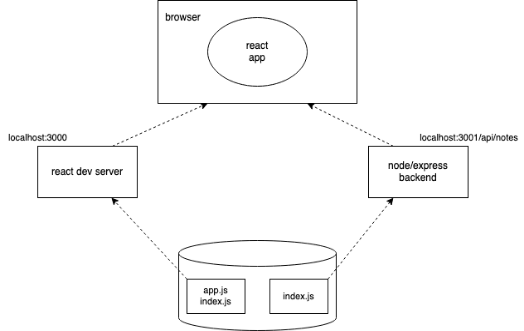
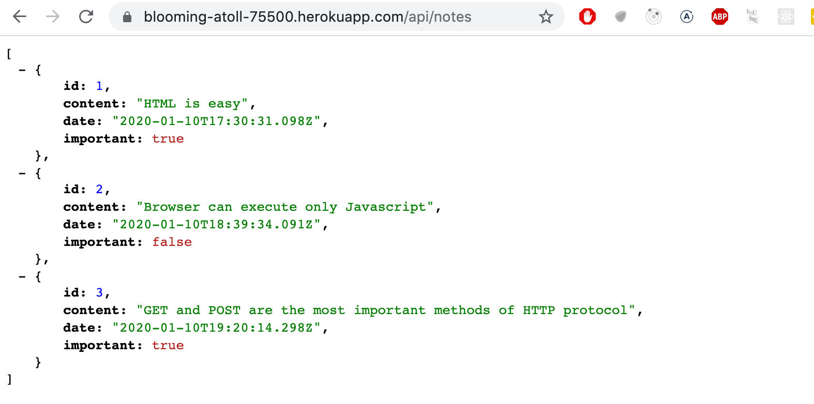
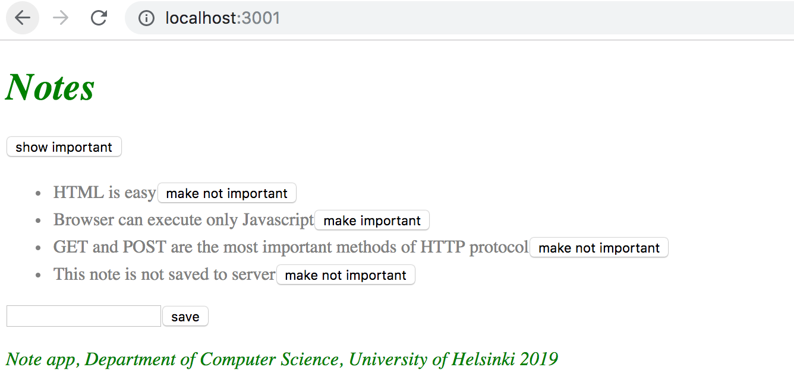
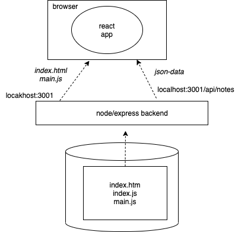
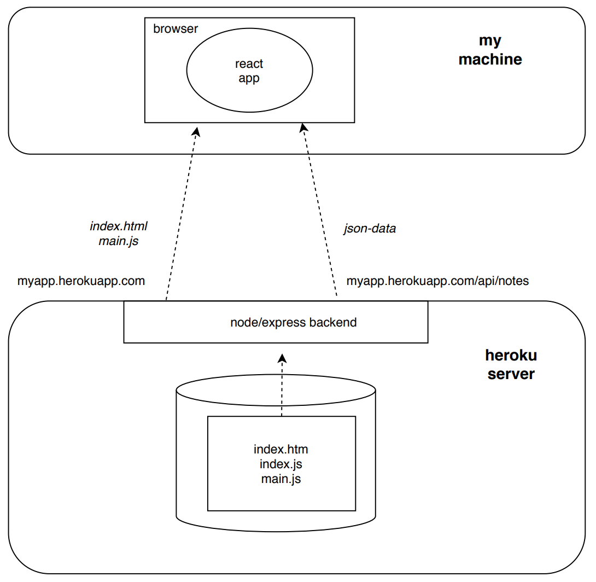
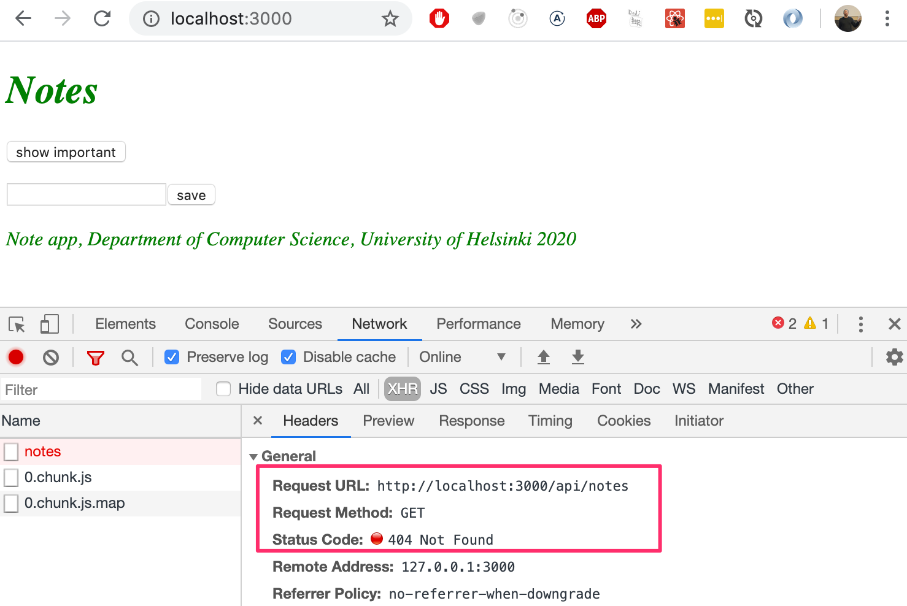

<div class="content">

<!-- Next let's connect the frontend we made in [part 2](/en/part2) to our own backend.-->
 接下来让我们把我们在[第二章节](/en/part2)中制作的前端连接到我们自己的后端。

<!-- In the previous part, the frontend could ask for the list of notes from the json-server we had as a backend, from the address http://localhost:3001/notes.-->
 在上一部分中，前端可以从我们作为后端的json-server中询问笔记列表，地址是http://localhost:3001/notes。
<!-- Our backend has a slightly different url structure now, as the notes can be found at http://localhost:3001/api/notes. Let's change the attribute __baseUrl__ in the <i>src/services/notes.js</i> like so:-->
 我们的后端现在有一个稍微不同的url结构，因为笔记可以在http://localhost:3001/api/notes。让我们改变<i>src/services/notes.js</i>中的属性__baseUrl__，像这样。

```js
import axios from 'axios'
const baseUrl = 'http://localhost:3001/api/notes' //highlight-line

const getAll = () => {
  const request = axios.get(baseUrl)
  return request.then(response => response.data)
}

// ...

export default { getAll, create, update }
```

<!-- We will also need to change the url specified in the effect in <i>App.js</i>:-->
 我们也需要改变<i>App.js</i>中效果中指定的url。

```js
  useEffect(() => {
    axios
      .get('http://localhost:3001/api/notes')
      .then(res => {
        setNotes(res.data)
      })
  }, [])
```

<!-- Frontendin tekemä GET-pyyntö osoitteeseen <http://localhost:3001/api/notes> ei jostain syystä toimi: -->
<!-- Now frontend's GET request to <http://localhost:3001/api/notes> does not work for some reason:-->
 现在 frontend's GET request to <http://localhost:3001/api/notes> 由于某些原因不能工作。


<!-- Mistä on kyse? Backend toimii kuitenkin selaimesta ja postmanista käytettäessä ilman ongelmaa. -->
<!-- What's going on here? We can access the backend from a browser and from postman without any problems.-->
 这里发生了什么？我们可以从浏览器和postman访问后端，没有任何问题。

### Same origin policy and CORS

<!-- The issue lies with a thing called CORS, or Cross-Origin Resource Sharing.-->
 问题在于一个叫做CORS的东西，或者说跨源资源共享。

<!-- According to [Wikipedia](https://en.wikipedia.org/wiki/Cross-origin_resource_sharing):-->
 根据[维基百科](https://en.wikipedia.org/wiki/Cross-origin_resource_sharing)。

<!-- > <i>Cross-origin resource sharing (CORS) is a mechanism that allows restricted resources (e.g. fonts) on a web page to be requested from another domain outside the domain from which the first resource was served. A web page may freely embed cross-origin images, stylesheets, scripts, iframes, and videos. Certain "cross-domain" requests, notably Ajax requests, are forbidden by default by the same-origin security policy.</i>-->
 > <i>跨源资源共享（CORS）是一种机制，它允许网页上的限制性资源（如字体）从第一个资源所来自的域之外的另一个域被请求。一个网页可以自由嵌入跨源图像、样式表、脚本、iframe和视频。某些 "跨域 "请求，特别是Ajax请求，在默认情况下是被同源安全策略所禁止的。

<!-- In our context the problem is that, by default, the JavaScript code of an application that runs in a browser can only communicate with a server in the same [origin](https://developer.mozilla.org/en-US/docs/Web/Security/Same-origin_policy).-->
在我们的环境中，问题在于，默认情况下，在浏览器中运行的应用的JavaScript代码只能与同一[来源](https://developer.mozilla.org/en-US/docs/Web/Security/Same-origin_policy)的服务器通信。
<!-- Because our server is in localhost port 3001, and our frontend in localhost port 3000, they do not have the same origin.-->
因为我们的服务器在localhost 3001端口，而我们的前端在localhost 3000端口，它们没有相同的起源。

<!-- Keep in mind, that [same origin policy](https://developer.mozilla.org/en-US/docs/Web/Security/Same-origin_policy) and CORS are not specific to React or Node. They are in fact universal principles of the operation of web applications.-->
 请记住，[同源策略](https://developer.mozilla.org/en-US/docs/Web/Security/Same-origin_policy)和 CORS 并不是专门针对 React 或 Node。它们实际上是网络应用操作的普遍原则。

<!-- We can allow requests from other <i>origins</i> by using Node's [cors](https://github.com/expressjs/cors) middleware.-->
 我们可以通过使用 Node's [cors](https://github.com/expressjs/cors) 中间件来允许来自其他<i>原点</i>的请求。

<!-- In your backend repository, install <i>cors</i> with the command-->
在你的后端仓库中，用命令安装<i>cors</i>。

```bash
npm install cors
```

<!-- take the middleware to use and allow for requests from all origins:-->
取中间件来使用，并允许来自所有源的请求。

```js
const cors = require('cors')

app.use(cors())
```

<!-- And the frontend works! However, the functionality for changing the importance of notes has not yet been implemented to the backend.-->
 前台就可以工作了!然而，改变笔记重要性的功能还没有在后端实现。

<!-- You can read more about CORS from [Mozillas page](https://developer.mozilla.org/en-US/docs/Web/HTTP/CORS).-->
 你可以从[Mozillas页面](https://developer.mozilla.org/en-US/docs/Web/HTTP/CORS)上阅读更多关于CORS的信息。

<!-- The setup of our app looks now as follows:-->
 我们的应用的设置现在看起来如下。



<!-- The react app running in the browser now fetches the data from node/express-server that runs in localhost:3001.-->
 在浏览器中运行的react应用现在从运行在localhost:3001的node/express-server获取数据。
### Application to the Internet

<!-- Now that the whole stack is ready, let's move our application to the internet. We'll use good old [Heroku](https://www.heroku.com) for this.-->
 现在整个堆栈已经准备好了，让我们把我们的应用移到互联网上。我们将使用古老的[Heroku](https://www.heroku.com)来完成。

<!-- >If you have never used Heroku before, you can find instructions from [Heroku documentation](https://devcenter.heroku.com/articles/getting-started-with-nodejs) or by Googling.-->
 >如果你以前从未使用过Heroku，你可以从[Heroku文档](https://devcenter.heroku.com/articles/getting-started-with-nodejs)中找到说明，或者通过谷歌搜索。

<!-- Add a file called  <i>Procfile</i> to the backend project's root to tell Heroku how to start the application.-->
 在后端项目的根目录下添加一个名为<i>Procfile</i>的文件，告诉Heroku如何启动应用。

```bash
web: npm start
```

<!-- Change the definition of the port our application uses at the bottom of the <i>index.js</i> file like so:-->
在<i>index.js</i>文件的底部改变我们应用使用的端口的定义，像这样。

```js
const PORT = process.env.PORT || 3001  // highlight-line
app.listen(PORT, () => {
  console.log(`Server running on port ${PORT}`)
})
```

<!-- Now we are using the port defined in [environment variable](https://en.wikipedia.org/wiki/Environment_variable) _PORT_ or port 3001 if the environment variable _PORT_ is undefined.-->
 现在我们使用的是[环境变量](https://en.wikipedia.org/wiki/Environment_variable) _PORT_中定义的端口，如果环境变量_PORT_未定义，则使用3001端口。
<!-- Heroku configures application port based on the environment variable.-->
Heroku根据环境变量来配置应用的端口。

<!-- Create a Git repository in the project directory, and add <i>.gitignore</i> with the following contents-->
 在项目目录下创建一个Git仓库，并添加<i>.gitignore</i>，内容如下

```bash
node_modules
```
<!-- Create Heroku account in https://devcenter.heroku.com/-->
在https://devcenter.heroku.com/，创建Heroku账户
<!-- Install Heroku package using the command: npm install -g heroku-->
 使用命令安装Heroku包：npm install -g heroku
<!-- Create a Heroku application with the command <i>heroku create</i>, commit your code to the repository and move it to Heroku with command <i>git push heroku main</i>.-->
 用命令<i>heroku create</i>创建一个Heroku应用，将你的代码提交到版本库，并用命令<i>git push heroku main</i>将其移到Heroku。

<!-- If everything went well, the application works:-->
 如果一切顺利，应用就能工作。



<!-- If not, the issue can be found by reading heroku logs with command <i>heroku logs</i>.-->
 如果没有，可以通过命令<i>heroku logs</i>阅读heroku日志来发现问题。

<!-- >**NB** At least in the beginning it's good to keep an eye on the heroku logs at all times. The best way to do this is with command <i>heroku logs -t</i> which prints the logs to console whenever something happens on the server.-->
 >***NB** 至少在开始的时候，随时注意heroku的日志是很好的。最好的方法是使用命令<i>heroku logs -t</i>，它可以在服务器上发生任何事情时将日志打印到控制台。

<!-- >**NB** If you are deploying from a git repository where your code is not on the main branch (i.e. if you are altering the [notes repo](https://github.com/fullstack-hy2020/part3-notes-backend/tree/part3-2) from the last lesson) you will need to run _git push heroku HEAD:master_. If you have already done a push to heroku, you may need to run _git push heroku HEAD:main --force_.-->
 >***NB** 如果你从一个git仓库部署，而你的代码不在主分支上（例如，如果你正在改变上一课的[notes repo](https://github.com/fullstack-hy2020/part3-notes-backend/tree/part3-2)），你将需要运行_git push heroku HEAD:master_。如果你已经做了推送到heroku，你可能需要运行_git push heroku HEAD:main --force_。

<!-- The frontend also works with the backend on Heroku. You can check this by changing the backend's address on the frontend to be the backend's address in Heroku instead of <i>http://localhost:3001</i>.-->
 前台也可以和Heroku的后台一起工作。你可以通过把前端的后端地址改为Heroku中的后端地址，而不是<i>http://localhost:3001</i>来检查。

<!-- The next question is, how do we deploy the frontend to the Internet? We have multiple options. Let's go through one of them next.-->
 接下来的问题是，我们如何将前端部署到互联网上？我们有多种选择。接下来让我们来看看其中的一个。

### Frontend production build

<!-- So far we have been running React code in <i>development mode</i>. In development mode the application is configured to give clear error messages, immediately render code changes to the browser, and so on.-->
 到目前为止，我们一直在<i>开发模式</i>中运行React代码。在开发模式下，应用被配置为给出清晰的错误信息，立即向浏览器渲染代码变化，等等。

<!-- When the application is deployed, we must create a [production build](https://reactjs.org/docs/optimizing-performance.html#use-the-production-build) or a version of the application which is optimized for production.-->
 当应用被部署时，我们必须创建一个[生产构建](https://reactjs.org/docs/optimizing-performance.html#use-the-production-build)或一个为生产而优化的应用版本。

<!-- A production build of applications created with <i>create-react-app</i> can be created with command [npm run build](https://github.com/facebookincubator/create-react-app#npm-run-build-or-yarn-build).-->
 用<i>create-react-app</i>创建的应用的生产构建可以用[npm run build](https://github.com/facebookincubator/create-react-app#npm-run-build-or-yarn-build)命令创建。

<!-- **NOTE:** at the time of writing (20th January 2022) create-react-app had a bug that causes the following error _TypeError: MiniCssExtractPlugin is not a constructor_-->
 **注意：**在撰写本文时（2022年1月20日）create-react-app有一个错误，导致以下错误_TypeError。MiniCssExtractPlugin不是一个构造函数。

<!-- A possible fix is found from [here](https://github.com/facebook/create-react-app/issues/11930). Add the following to the file <i>package.json</i>-->
 从[这里](https://github.com/facebook/create-react-app/issues/11930)可以找到一个可能的修正。在文件<i>package.json</i>中添加以下内容

```json
{
  // ...
  "resolutions": {
    "mini-css-extract-plugin": "2.4.5"
  }
}
```

<!-- and run commands-->
 然后运行命令

```
rm -rf package-lock.json
rm -rf node_modules
npm cache clean --force
npm install
```

<!-- After these _npm run build_ should work.-->
 在这些_npm run build_之后，应该可以工作。

<!-- Let's run this command from the <i>root of the frontend project</i>.-->
 让我们从前端项目的<i>根部运行这个命令</i>。

<!-- This creates a directory called <i>build</i> (which contains the only HTML file of our application, <i>index.html</i> ) which contains the directory <i>static</i>. [Minified](<https://en.wikipedia.org/wiki/Minification_(programming)>) version of our application's JavaScript code will be generated to the <i>static</i>  directory. Even though the application code is in multiple files, all of the JavaScript will be minified into one file. Actually all of the code from all of the application's dependencies will also be minified into this single file.-->
 这将创建一个名为<i>build</i>的目录（其中包含我们应用的唯一HTML文件，<i>index.html</i>），该目录包含<i>static</i>。我们应用的[Minified](<https://en.wikipedia.org/wiki/Minification_(programming)>)版本的JavaScript代码将被生成到<i>static</i>目录中。即使应用的代码在多个文件中，所有的JavaScript都将被最小化为一个文件。事实上，所有应用的依赖性代码也将被压缩到这个文件中。

<!-- The minified code is not very readable. The beginning of the code looks like this:-->
 分解后的代码可读性不强。代码的开头如下所示：

```js
!function(e){function r(r){for(var n,f,i=r[0],l=r[1],a=r[2],c=0,s=[];c<i.length;c++)f=i[c],o[f]&&s.push(o[f][0]),o[f]=0;for(n in l)Object.prototype.hasOwnProperty.call(l,n)&&(e[n]=l[n]);for(p&&p(r);s.length;)s.shift()();return u.push.apply(u,a||[]),t()}function t(){for(var e,r=0;r<u.length;r++){for(var t=u[r],n=!0,i=1;i<t.length;i++){var l=t[i];0!==o[l]&&(n=!1)}n&&(u.splice(r--,1),e=f(f.s=t[0]))}return e}var n={},o={2:0},u=[];function f(r){if(n[r])return n[r].exports;var t=n[r]={i:r,l:!1,exports:{}};return e[r].call(t.exports,t,t.exports,f),t.l=!0,t.exports}f.m=e,f.c=n,f.d=function(e,r,t){f.o(e,r)||Object.defineProperty(e,r,{enumerable:!0,get:t})},f.r=function(e){"undefined"!==typeof Symbol&&Symbol.toStringTag&&Object.defineProperty(e,Symbol.toStringTag,{value:"Module"})
```

### Serving static files from the backend

<!-- One option for deploying the frontend is to copy the production build (the <i>build</i> directory) to the root of the backend repository and configure the backend to show the frontend's <i>main page</i> (the file <i>build/index.html</i>) as its main page.-->
 部署前端的一个选择是将生产构建（<i>build</i>目录）复制到后端仓库的根目录，并配置后端以显示前端的<i>主页</i>（文件<i>build/index.html</i>）作为其主页面。

<!-- We begin by copying the production build of the frontend to the root of the backend. With a Mac or Linux computer, the copying can be done from the frontend directory with the command-->
 我们首先把前台的生产构建复制到后台的根目录下。在Mac或Linux电脑上，复制可以在前端目录下用命令完成

```bash
cp -r build ../notes-backend
```

<!-- If you are using a Windows computer, you may use either [copy](https://www.windows-commandline.com/windows-copy-command-syntax-examples/) or [xcopy](https://www.windows-commandline.com/xcopy-command-syntax-examples/) command instead. Otherwise, simply do a copy and paste.-->
 如果你使用的是Windows电脑，你可以用[copy](https://www.windows-commandline.com/windows-copy-command-syntax-examples/)或[xcopy](https://www.windows-commandline.com/xcopy-command-syntax-examples/)命令代替。否则，只需进行复制和粘贴。

<!-- The backend directory should now look as follows:-->
 后台目录现在应该是这样的。


<!-- To make express show <i>static content</i>, the page <i>index.html</i> and the JavaScript, etc., it fetches, we need a built-in middleware from express called [static](http://expressjs.com/en/starter/static-files.html).-->
 为了使express显示<i>静态内容</i>，页面<i>index.html</i>和它获取的JavaScript等，我们需要express的一个内置的中间件，叫做[static](http://expressjs.com/en/starter/static-files.html)。

<!-- When we add the following amidst the declarations of middlewares-->
当我们在中间件的声明中加入以下内容时
```js
app.use(express.static('build'))
```

<!-- whenever express gets an HTTP GET request it will first check if the <i>build</i> directory contains a file corresponding to the request's address. If a correct file is found, express will return it.-->
每当express收到一个HTTP GET请求时，它将首先检查<i>build</i>目录中是否包含一个与请求地址相对应的文件。如果找到了正确的文件，express将返回它。

<!-- Now HTTP GET requests to the address <i>www.serversaddress.com/index.html</i> or <i>www.serversaddress.com</i> will show the React frontend. GET requests to the address <i>www.serversaddress.com/api/notes</i> will be handled by the backend's code.-->
 现在，对地址<i>www.serversaddress.com/index.html</i>或<i>www.serversaddress.com</i>的HTTP GET请求将显示React前端。对地址<i>www.serversaddress.com/api/notes</i>的GET请求将由后端's代码处理。

<!-- Because of our situation, both the frontend and the backend are at the same address, we can declare _baseUrl_ as a [relative](https://www.w3.org/TR/WD-html40-970917/htmlweb.html#h-5.1.2) URL. This means we can leave out the part declaring the server.-->
 由于我们的情况，前端和后端都在同一个地址，我们可以将_baseUrl_声明为一个[相对](https://www.w3.org/TR/WD-html40-970917/htmlweb.html#h-5.1.2)URL。这意味着我们可以省去声明服务器的部分。

```js
import axios from 'axios'
const baseUrl = '/api/notes' // highlight-line

const getAll = () => {
  const request = axios.get(baseUrl)
  return request.then(response => response.data)
}

// ...
```

<!-- After the change, we have to create a new production build and copy it to the root of the backend repository.-->
 更改后，我们必须创建一个新的生产构建，并将其复制到后端仓库的根目录。

<!-- The application can now be used from the <i>backend</i> address <http://localhost:3001>:-->
 应用现在可以从<i>后端</i>地址<http://localhost:3001>使用。



<!-- Our application now works exactly like the [single-page app](/en/part0/fundamentals_of_web_apps#single-page-app) example application we studied in part 0.-->
 我们的应用现在的工作方式与我们在第0章节学习的[单页应用](/en/part0/fundamentals_of_web_apps#single-page-app)示例应用完全相同。

<!-- When we use a browser to go to the address <http://localhost:3001>, the server returns the <i>index.html</i> file from the <i>build</i> repository. Summarized contents of the file are as follows:-->
当我们用浏览器进入<http://localhost:3001>地址时，服务器从<i>build</i>仓库返回<i>index.html</i>文件。该文件的内容摘要如下。

```html
<head>
  <meta charset="utf-8"/>
  <title>React App</title>
  <link href="/static/css/main.f9a47af2.chunk.css" rel="stylesheet">
</head>
<body>
  <div id="root"></div>
  <script src="/static/js/1.578f4ea1.chunk.js"></script>
  <script src="/static/js/main.104ca08d.chunk.js"></script>
</body>
</html>
```

<!-- The file contains instructions to fetch a CSS stylesheet defining the styles of the application, and two <i>script</i> tags which instruct the browser to fetch the JavaScript code of the application - the actual React application.-->
 该文件包含获取定义应用样式的CSS样式表的指令，以及两个<i>script</i>标签，指示浏览器获取应用的JavaScript代码--实际的React应用。

<!-- The React code fetches notes from the server address <http://localhost:3001/api/notes> and renders them to the screen. The communications between the server and the browser can be seen in the <i>Network</i> tab of the developer console:-->
 React代码从服务器地址<http://localhost:3001/api/notes>获取注释，并将其渲染到屏幕上。服务器和浏览器之间的通信可以在开发者控制台的<i>Network</i>标签中看到。


<!-- The setup that is ready for product deployment looks as follows:-->
 准备用于产品部署的设置看起来如下。



<!-- Unlike when running the app in a development environment, everything is now in the same node/express-backend that runs in localhost:3001. When the browser goes to the page, the file <i>index.html</i> is rendered. That causes the browser to fetch the product version of the React app. Once it starts to run, it fetches the json-data from the address localhost:3001/api/notes.-->
 与在开发环境中运行应用时不同，现在所有东西都在同一个节点/express-backend中，该节点在localhost:3001中运行。当浏览器进入页面时，文件<i>index.html</i>被渲染。这导致浏览器获取React应用的产品版本。一旦开始运行，它就从localhost:3001/api/notes这个地址获取json-data。

### The whole app to internet

<!-- After ensuring that the production version of the application works locally, commit the production build of the frontend to the backend repository, and push the code to Heroku again.-->
 在确保应用的生产版本在本地运行后，将前端的生产构建提交到后端仓库，并再次将代码推送到Heroku。

<!-- [The application](https://obscure-harbor-49797.herokuapp.com/) works perfectly, except we haven't added the functionality for changing the importance of a note to the backend yet.-->
 [应用](https://obscure-harbor-49797.herokuapp.com/)工作得很好，只是我们还没有在后端添加改变笔记重要性的功能。


<!-- Our application saves the notes to a variable. If the application crashes or is restarted, all of the data will disappear.-->
 我们的应用将笔记保存在一个变量中。如果应用崩溃或重新启动，所有的数据都会消失。

<!-- The application needs a database. Before we introduce one, let's go through a few things.-->
 该应用需要一个数据库。在我们引入一个数据库之前，让我们先看一下几件事。

<!-- The setup looks like now as follows:-->
现在的设置看起来如下。



<!-- The node/express-backend now resides in the Heroku server. When the root address that is of the form https://glacial-ravine-74819.herokuapp.com/ is accessed, the browser loads and executes the React app that fetches the json-data from the Heroku server.-->
 节点/express-backend现在驻扎在Heroku服务器上。当访问形式为https://glacial-ravine-74819.herokuapp.com/ 的根地址时，浏览器会加载并执行React应用，从Heroku服务器上获取json数据。

###  Streamlining deploying of the frontend

<!-- To create a new production build of the frontend without extra manual work, let's add some npm-scripts to the <i>package.json</i> of the backend repository:-->
 为了创建一个新的前端生产构建，不需要额外的手工工作，让我们在后端仓库的<i>package.json</i>中添加一些npm脚本。

```json
{
  "scripts": {
    //...
    "build:ui": "rm -rf build && cd ../part2-notes/ && npm run build && cp -r build ../notes-backend",
    "deploy": "git push heroku main",
    "deploy:full": "npm run build:ui && git add . && git commit -m uibuild && npm run deploy",
    "logs:prod": "heroku logs --tail"
  }
}
```

<!-- The script _npm run build:ui_ builds the frontend and copies the production version under the backend repository.  _npm run deploy_ releases the current backend to heroku.-->
 脚本 _npm run build:ui_ 构建前端，并将生产版本复制到后端仓库下。  _npm run deploy_释放当前的后端到heroku。

<!-- _npm run deploy:full_ combines these two and contains the necessary <i>git</i> commands to update the backend repository.-->
 _npm run deploy:full_结合了这两者，并包含必要的<i>git</i>命令来更新后端仓库。

<!-- There is also a script _npm run logs:prod_ to show the heroku logs.-->
 还有一个脚本_npm run logs:prod_来显示heroku的日志。

<!-- Note that the directory paths in the script <i>build:ui</i> depend on the location of repositories in the file system.-->
 注意，脚本<i>build:ui</i>中的目录路径取决于文件系统中存储库的位置。

<!-- >**NB**  On Windows, npm scripts are executed in cmd.exe as the default shell which does not support bash commands. For the above bash commands to work, you can change the default shell to Bash (in the default Git for Windows installation) as follows:-->
 >***NB** 在Windows上，npm脚本在cmd.exe中执行，作为默认的shell，不支持bash命令。为了让上述bash命令发挥作用，你可以将默认的shell改为Bash（在默认的Git for Windows安装中），方法如下。

```md
npm config set script-shell "C:\\Program Files\\git\\bin\\bash.exe"
```

<!-- Another option is the use of [shx](https://www.npmjs.com/package/shx).-->
 另一个选择是使用 [shx](https://www.npmjs.com/package/shx)。

### Proxy

<!-- Changes on the frontend have caused it to no longer work in development mode (when started with command _npm start_), as the connection to the backend does not work.-->
 前台的变化导致它在开发模式下不再工作（当用_npm start_命令启动时），因为与后台的连接不起作用。



<!-- This is due to changing the backend address to a relative URL:-->
 这是由于将后端地址改为相对的URL。

```js
const baseUrl = '/api/notes'
```

<!-- Because in development mode the frontend is at the address <i>localhost:3000</i>, the requests to the backend go to the wrong address <i>localhost:3000/api/notes</i>. The backend is at <i>localhost:3001</i>.-->
 因为在开发模式下，前端的地址是<i>localhost:3000</i>，对后端的请求会进入错误的地址<i>localhost:3000/api/notes</i>。后台是在<i>localhost:3001</i>。

<!-- If the project was created with create-react-app, this problem is easy to solve. It is enough to add the following declaration to the <i>package.json</i> file of the frontend repository.-->
 如果该项目是用create-react-app创建的，这个问题很容易解决。只需在前端仓库的<i>package.json</i>文件中添加以下声明。

```bash
{
  "dependencies": {
    // ...
  },
  "scripts": {
    // ...
  },
  "proxy": "http://localhost:3001"  // highlight-line
}
```

<!-- After a restart, the React development environment will work as a [proxy](https://create-react-app.dev/docs/proxying-api-requests-in-development/). If the React code does an HTTP request to a server address at <i>http://localhost:3000</i> not managed by the React application itself (i.e. when requests are not about fetching the CSS or JavaScript of the application), the request will be redirected to the server at <i>http://localhost:3001</i>.-->
 重启后，React开发环境将作为一个[代理](https://create-react-app.dev/docs/proxying-api-requests-in-development/)工作。如果React代码向<i>http://localhost:3000</i>的服务器地址做HTTP请求，而不是由React应用本身管理（即当请求不是关于获取应用的CSS或JavaScript），该请求将被重定向到<i>http://localhost:3001</i>的服务器。

<!-- Now the frontend is also fine, working with the server both in development- and production mode.-->
 现在前端也很好，在开发和生产模式下都能与服务器一起工作。

<!-- A negative aspect of our approach is how complicated it is to deploy the frontend. Deploying a new version requires generating new production build of the frontend and copying it to the backend repository. This makes creating an automated [deployment pipeline](https://martinfowler.com/bliki/DeploymentPipeline.html) more difficult. Deployment pipeline means an automated and controlled way to move the code from the computer of the developer through different tests and quality checks to the production environment. Building a deployment pipeline is the topic of [part 11](https://fullstackopen.com/en/part11) of this course.-->
 我们的方法的一个消极方面是部署前端是多么的复杂。部署一个新的版本需要生成新的前端生产版本并将其复制到后端仓库。这使得创建一个自动化的[部署管道](https://martinfowler.com/bliki/DeploymentPipeline.html)更加困难。部署管道是指通过不同的测试和质量检查，将代码从开发者的电脑中转移到生产环境中的一种自动化和可控的方式。构建一个部署管道是本课程[第11部分](https://fullstackopen.com/en/part11)的主题。

<!-- There are multiple ways to achieve this (for example placing both backend and frontend code [to the same repository](https://github.com/mars/heroku-cra-node) ) but we will not go into those now.-->
有多种方法来实现这个目标（例如，将后端和前端的代码[放在同一个仓库](https://github.com/mars/heroku-cra-node)），但我们现在不会去讨论这些。

<!-- In some situations it may be sensible to deploy the frontend code as its own application. With apps created with create-react-app it is [straightforward](https://github.com/mars/create-react-app-buildpack).-->
 在某些情况下，将前端代码部署为自己的应用可能是明智的。对于用create-react-app创建的应用，这是[直接的](https://github.com/mars/create-react-app-buildpack)。

<!-- Current code of the backend can be found on [Github](https://github.com/fullstack-hy2020/part3-notes-backend/tree/part3-3), in the branch <i>part3-3</i>. The changes in frontend code are in <i>part3-1</i> branch of the [frontend repository](https://github.com/fullstack-hy2020/part2-notes/tree/part3-1).-->
 后台的当前代码可以在[Github](https://github.com/fullstack-hy2020/part3-notes-backend/tree/part3-3)的分支<i>part3-3</i>中找到。前台代码的变化在[frontend repository](https://github.com/fullstack-hy2020/part2-notes/tree/part3-1)的<i>part3-1</i>分支中。

</div>

<div class="tasks">

### Exercises 3.9.-3.11.

<!-- The following exercises don't require many lines of code. They can however be challenging, because you must understand exactly what is happening and where, and the configurations must be just right.-->
 下面的练习不需要很多行的代码。然而，它们可能是具有挑战性的，因为你必须确切地了解正在发生什么和在哪里发生，而且配置必须恰到好处。

#### 3.9 phonebook backend step9

<!-- Make the backend work with the phonebook frontend from the exercises of the previous part. Do not implement the functionality for making changes to the phone numbers yet, that will be implemented in exercise 3.17.-->
 使后端与上一部分练习中的电话簿前端一起工作。先不要实现对电话号码进行修改的功能，这将在练习3.17中实现。

<!-- You will probably have to do some small changes to the frontend, at least to the URLs for the backend. Remember to keep the developer console open in your browser. If some HTTP requests fail, you should check from the <i>Network</i>-tab what is going on. Keep an eye on the backend's console as well. If you did not do the previous exercise, it is worth it to print the request data or <i>request.body</i> to the console in the event handler responsible for POST requests.-->
 你可能需要对前台做一些小的改动，至少要对后台的URL做一些改动。记得在你的浏览器中保持开放的开发者控制台。如果一些HTTP请求失败了，你应该从<i>Network</i>-tab中检查发生了什么。也要注意后台的控制台。如果你没有做前面的练习，在负责POST请求的事件处理程序中把请求数据或<i>request.body</i>打印到控制台是值得的。

#### 3.10 phonebook backend step10

<!-- Deploy the backend to the internet, for example to Heroku.-->
 将后端部署到互联网上，例如部署到Heroku。

<!-- **NB** the command _heroku_ works on the department's computers and the freshman laptops. If for some reason you cannot [install](https://devcenter.heroku.com/articles/heroku-cli) Heroku to your computer, you can use the command [npx heroku](https://www.npmjs.com/package/heroku).-->
 **NB**命令_heroku_在系里的电脑和新生的笔记本上都可以使用。如果由于某些原因你不能[安装](https://devcenter.heroku.com/articles/heroku-cli)Heroku到你的电脑上，你可以使用命令[npx heroku](https://www.npmjs.com/package/heroku)。

<!-- Test the deployed backend with a browser and Postman or VS Code REST client to ensure it works.-->
 用浏览器和Postman或VS Code REST客户端测试已部署的后端，以确保其工作。

<!-- **PRO TIP:** When you deploy your application to Heroku, it is worth it to at least in the beginning keep an eye on the logs of the heroku application **AT ALL TIMES** with the command <em>heroku logs -t</em>.-->
 **专业提示：**当你将你的应用部署到Heroku时，至少在开始时值得用命令<em>heroku logs -t</em>来关注heroku应用的日志，**在任何时候。

<!-- The following is a log about one typical problem. Heroku cannot find application dependency <i>express</i>:-->
 下面是一个典型问题的日志。Heroku无法找到应用的依赖项<i>express</i>。


<!-- The reason is that the <i>express</i> package has not been installed with the <em>npm install express</em> command, so information about the dependency was not saved to the file <i>package.json</i>.-->
 原因是<i>express</i>包没有被<em>npm install express</em>命令安装，所以关于这个依赖的信息没有被保存到<i>package.json</i>文件中。

<!-- Another typical problem is that the application is not configured to use the port set to environment variable <em>PORT</em>:-->
 另一个典型的问题是，应用没有被配置为使用设置在环境变量<em>PORT</em>中的端口。


<!-- Create a README.md at the root of your repository, and add a link to your online application to it.-->
 在你的版本库根部创建一个README.md，并在其中添加一个在线应用的链接。

#### 3.11 phonebook full stack

<!-- Generate a production build of your frontend, and add it to the internet application using the method introduced in this part.-->
 为你的前端生成一个生产版本，并使用本章节介绍的方法将其添加到互联网应用中。

<!-- **NB** Make sure the directory <i>build</i> is not gitignored-->
 **NB* 确保目录<i>build</i>没有被gitignored

<!-- Also make sure that the frontend still works locally (in development mode when started with command _npm start_).-->
 还要确保前端在本地仍然可以工作（在开发模式下，用_npm start_命令启动）。

<!-- If you have problems to get the app working make sure that your directory structure matches the one of [the example app](https://github.com/fullstack-hy2020/part3-notes-backend/tree/part3-3).-->
 如果你有问题让应用工作，请确保你的目录结构与[示例应用](https://github.com/fullstack-hy2020/part3-notes-backend/tree/part3-3)的结构一致。

</div>
